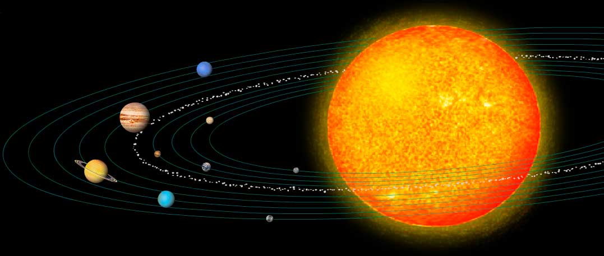
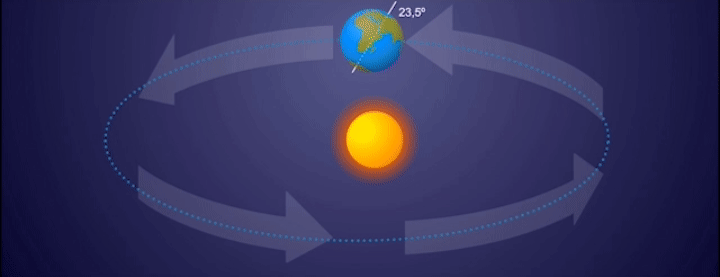
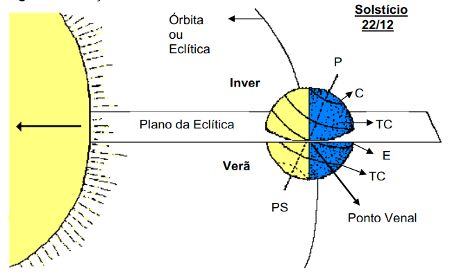
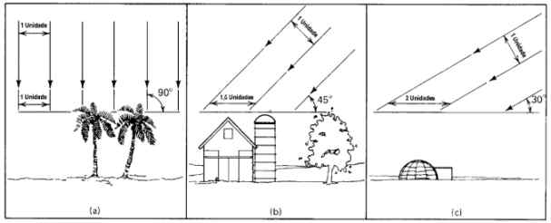
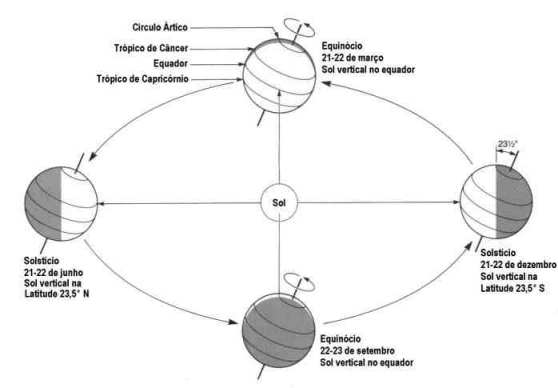
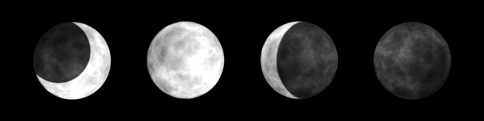
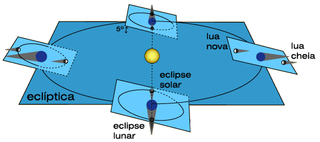
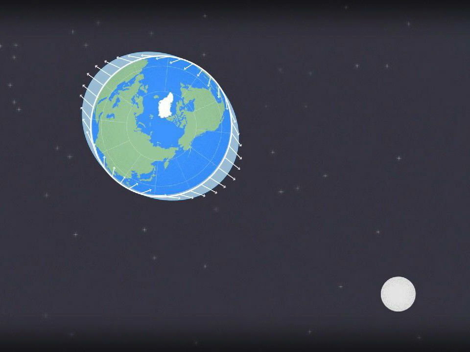

# Geografia

## Conceitos da Geografia

A Geografia é a ciência que estuda a **organização do espaço** pelo Homem

O **objeto de estudo** da Geografia está nas relações **entre os homens** e **entre os homens e a natureza**

    tudo aquilo que podemos visualizar, sentir a textura, fotografar, mapear, enfim, as manifestações concretas da natureza e da sociedade

---

O **objetivo** dos conhecimentos produzidos pela Geografia é contribuir para o entendimento do mundo atual

As observações dos céus e dos solos produziram fatos e informações para que formassem o **conhecimento geográfico**

    A Geografia é dividida em disciplinas agrupadas em duas vertentes, que se contradizem e se complementam: Geografia Física (ciências da natureza) e a Geografia Humana (ciências humanas).

---

# Astronomia

## Universo

O Universo originou-se de uma gigantesca explosão, chamada de **Big Bang**, que ocorreu entre 15 e 10 bilhões de anos atrás

    Toda matéria que existe formou-se em uma fração de segundo, em um espaço infinitamente pequeno, e estendeu-se a uma velocidade incrível, de maneira simultânea. À medida que o Universo se expandia, as temperaturas extremamente altas da matéria expelida diminuíam. Com esse resfriamento, as diminutas partículas fundamentais se combinaram e formaram prótons e nêutrons, que por sua vez formaram os átomos dos gases hidrogênio e hélio. Esses gases formam na atualidade a maior parte do Universo.
    Segundo estudos atuais, o Universo continua se expandindo. Talvez um dia esse movimento possa se deter, ocorrendo uma contração final, chamada pelos cientistas de Big Crunch.

](assets/astro_bexiga-big-bang.gif)

::: notes

É como uma bexiga enchendo...

    Teoria do big bang surge a partir das observações de Hubble, que mensurou as distâncias entre as galáxias e mostrou que elas estavam se afastando uma das outras. Se elas se afastam, um dia elas deveriam estar juntas.
    Imaginem uma bexiga, com desenhos de muitas pequenas estrelas. Agora vamos encher a bexiga, e conforme isso acontece, as estrelas vão se afastando uma das outras. Elas não mudam de tamanho, mas o espaço entre elas (na borracha) que aumenta. Com o Universo acontece o mesmo, as distâncias aumentam conforme passa o tempo.     
    Ainda na bexiga, imaginem que somos uma formiga, que anda pela superfície, mas não conseguimos olhar para cima ou para baixo. Estas somos nós no Universo, que enxergamos em 3 dimensões (3D), e para onde ele se expande é a 4ª dimensão, ou seja, o tempo. Nós só temos acesso à essa dimensão, quando chegamos lá.

:::

---

## Sistema Solar

É composto pelo Sol e todos os corpos celestes que orbitam ao seu redor

    que incluem oito planetas e seus respectivos satélites naturais (como é o caso de nossa Lua), os planetas-anão (Plutão, Ceres, Makemake, Haumea e Eris) e seus satélites, bem como os asteroides, cometas e outras incontáveis partículas.

---

Várias teorias já foram lançadas para explicar a posição da Terra no Sistema Solar.

    O Sistema Geocêntrico afirmava que a Terra era fixa e o centro do Universo. No século XVI, Nicolau Copérnico propôs a teoria do Sistema Heliocêntrico afirmando que "o Sol é o centro de nosso sistema planetário e os planetas giram ao seu redor em orbitas circulares" Johannes Kepler, no início do século XVII, foi quem demonstrou que na verdade as órbitas são elípticas.

---

## Mecânica celeste

As **Leis de Kepler** nos diz que a órbita de um planeta é **elíptica**. Na aplicação abaixo, experimente lançar um corpo ao redor do Sol.

    Por ter uma órbita elíptica, em determinado momento o corpo estará mais próximo do Sol (chamado de afélio), no outro estará mais distante (periélio).

<iframe src="https://galileoandeinstein.phys.virginia.edu/more_stuff/Applets/Kepler/kepler.html" frameborder="1" title="Simulação das Leis de Kepler" allowfullscreen="true"></iframe>

::: notes

Quanto mais distante um planeta está do Sol, mais devagar ele se move!

[Simulação das Leis de Kepler](https://galileoandeinstein.phys.virginia.edu/more_stuff/Applets/Kepler/kepler.html)

:::

---

## Movimentos da Terra e estações do ano

A Terra tem dois movimentos principais: **rotação** e **translação**

    A rotação em torno de seu eixo é responsável pelo ciclo dia-noite. 
    A translação se refere ao movimento da Terra em sua órbita elíptica em torno do Sol.

::: notes

As estações do ano não ocorrem pela variação da proximidade da Terra e o Sol, mas sim como consequência do eixo inclinado da Terra.

    Se assim fosse, teríamos na mesma época do ano a mesma estação nos dois hemisférios, o que não é verdade, pois quando é verão no hemisfério norte é inverno no hemisfério sul e vice-versa.

:::

---

Mas o eixo do Globo Terrestre é inclinado em relação a quê?

    A  Terra  gira  em  um  eixo  inclinado  em  relação  a  um  plano  imaginário  que passa ao mesmo tempo pelo seu centro e pelo centro do Sol. Esse plano imaginário é o plano da órbita ou eclíptica terrestre que forma um ângulo agudo de 23º 27’ com o  plano  do  Equador.

---

Por conta dessa inclinação, a luz solar não atinge igualmente os dois hemisférios, a consequência disso são as estações do ano.

    numa dada época do ano, um dos hemisférios fica mais voltado para o Sol. Isso resulta em estações do ano opostas: quando é verão no hemisfério norte, é inverno no sul; quando é primavera no norte, é outono no sul, e assim sucessivamente. As estações do ano, portanto, também podem ser consideradas uma das consequências do movimento de translação da Terra.

---

Equinócio e solstício

    Há 4 dias com especial significado na variação anual dos raios solares em relação à Terra. No dia 21 ou 22/12 os raios solares incidem verticalmente no Trópico de Capricórnio. Este é o solstício de verão para o Hemisfério Sul (HS). Em 21 ou 22/6 eles incidem verticalmente no Trópico de Câncer. Este é o solstício de inverno para o HS. A meio caminho entre os solstícios ocorrem os equinócios (dias e noites de igual duração). Nestas datas os raios verticais do Sol atingem o equador (latitude = 0°). No HS o equinócio de primavera ocorre em 22 ou 23 de setembro e o de outono em 21 ou 22 de março.

---

## Lua

As _fases da lua_ resultam do seu movimento de **translação** e do fato de que ela não é um corpo luminoso, mas um corpo iluminado pela luz Solar.

    Translação: movimento que a lua realiza em torno da Terra. Dura ~27 dias; a órbita descrita é elíptica, e possui inclinação de 5º com o plano da órbita terrestre. O efeito disso são as fases da lua.
    Rotação: movimento de giro sobre seu próprio eixo, com duração de ~27 dias. Por estar sincronizada com a translação, sempre vemos o mesmo lado da lua.
    Revolução: movimento realizado, junto com a Terra, ao redor do Sol. Dura ~365 dias.

::: notes

REFERÊNCIAS:

["Fases Lunares, 2018 Hemisfério sul"](https://svs.gsfc.nasa.gov/4605)

:::

---

### Eclipse

Um **eclipse** ocorre quando um corpo entra na sombra do outro.

    A órbita da Terra (em torno do Sol) e a órbita da Lua (em torno da Terra) não estão no mesmo plano, se assim fosse, ocorreria um eclipse lunar a cada Lua Cheia, e um eclipse solar a cada Lua Nova. Só ocorrerão eclipses quando a Lua estiver nas fases Cheia ou Nova e quando o Sol estiver na linha dos nodos, que é a linha de intersecção dos planos das duas órbitas.

::: notes

REFERÊNCIAS:

[Eclipse Solar :: 29 Março 2006](https://www.astro.up.pt/caup/eventos/2006Mar29/ciencia.php)

:::

---

### Marés

"Maré alta" e "maré baixa" são os termos que usamos pra descrever os oceanos em determinadas épocas do ano. Este fenomeno chamado **efeito maré** tem a ver com a posição da Lua!

As **marés** ocorrem devido às deformações sofridas pelas massas líquidas dos oceanos, provocadas pelas **atrações da Lua e do Sol**

<iframe width="560" height="315" src="https://www.youtube-nocookie.com/embed/sYss-N7EnEw" title="YouTube video player" frameborder="0" allow="accelerometer; autoplay; clipboard-write; encrypted-media; gyroscope; picture-in-picture" allowfullscreen></iframe>

---

## Referências e materiais complementares

[Astrolab | Youtube](https://www.youtube.com/playlist?list=PLTKZh-tngi2VcRTo4LmyXkmuV_qP3DWjc)

    Astrolab é um programa da TV Unesp em parceria com o Observatório Astronômico 'Lionel José Andriatto' da Unesp de Bauru. Ele visa divulgar curiosidades, dados, teorias e novidades da astronomia com uma linguagem acessível, para curiosos de todas as idades!

---
