# Cartografia

## Projeções cartograficas

Todo mapa revela uma determinada visão de mundo!

:::: {.columns}
::: {.column}

Projeção de Mercator

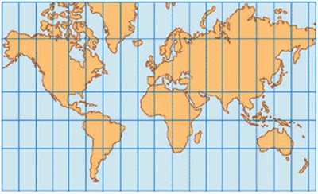{.stretch}

- Mantém forma e não proporção (áreas distorcidas)
- Eurocentrismo

:::
::: {.column}

Projeção de Peters

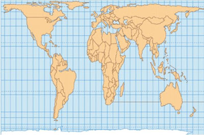{.stretch}

- Alterou fromas para manter proporção
- Valorização do mundo subdesenvolvido

:::
::::

::: notes

REFERÊNCIAS:

- [Projeções de Mercator e Peters:
Diferentes maneiras de ver o Mundo!](https://geoprofessora.blogspot.com/2008/09/mercator-x-peters.html)

PARA IR ALÉM:

- [[PodTerritorial] Professor da Unesp explica o que é Cartografia Geográfica Crítica](https://podcast.unesp.br/15548/podterritorial-professor-da-unesp-explica-o-que-e-cartografia-geografica-critica) - Eduardo Paulon Girardi, especialista em geografia agrária da Unesp em Presidente Prudente e membro da Rede Dataluta, explica o que é Cartografia Geográfica Crítica.

:::

---

### O "Hack" do Google Maps

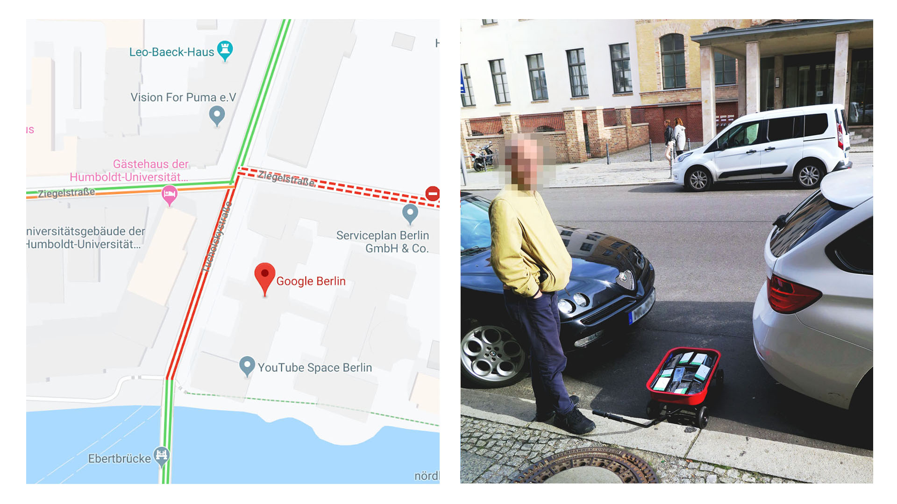{.stretch}

::: {#gmaps-hack}
:::

::: notes

REFERÊNCIAS:

- [Google Maps Hacks (em inglês)](http://www.simonweckert.com/googlemapshacks.html)

PARA IR ALÉM:

- [Os territórios que o Google Maps esconde - Outras Palavras](https://outraspalavras.net/tecnologiaemdisputa/os-territorios-que-o-google-maps-esconde/) - Palestina, Caxemira e outros espaços que o poder global quer esconder são quase apagados, nos mapas da gigante da internet. Em seu lugar, um leve tracejado, sinal de que podem desaparecer. Há alternativa: o OpenStreetMap, plataforma livre

:::

---

## Mais materiais

- Boa explicação sobre:
  - Cartografia: [IBGE | Atlas Escolar | conceitos gerais | o que é cartografia?](https://atlasescolar.ibge.gov.br/conceitos-gerais/o-que-e-cartografia)
  - Astronomia: [IBGE | Atlas Escolar | a terra | nosso planeta no universo](https://atlasescolar.ibge.gov.br/a-terra/nosso-planeta-no-universo)

# Geomorfologia

## Camadas da Terra

:::: {.columns}
::: {.column width="60%"}

- **Núcleo**: sólido - composto por ligas metálicas;
- **Manto**: pastoso - rochas derretidas;
- **Crosta**: oceânica e continental.

:::
::: {.column width="40%"}

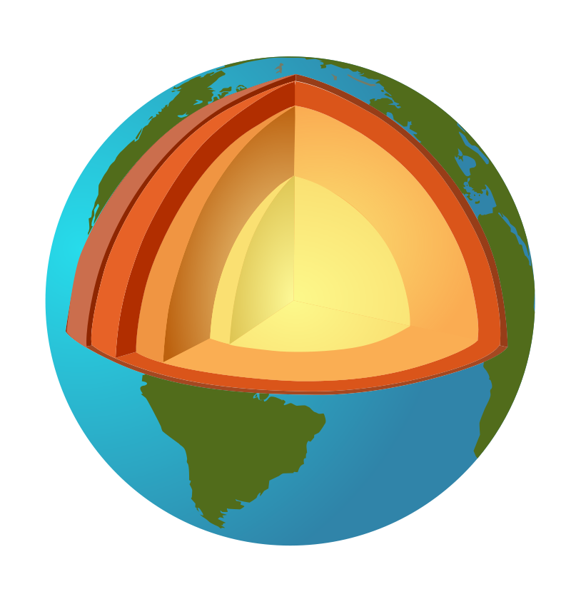{.rt-stretch}

:::
::::

<u>LITOSFERA</u>: Camada sólida mais externa constituída por rochas e solo e que sofre forças internas do manto e núcleo.

---

## Teoria da deriva continental

- Há 250 milhões de anos, os continentes estavam agrupados em um único (<u>pangeia</u>) - Alfred Wegener, 1915

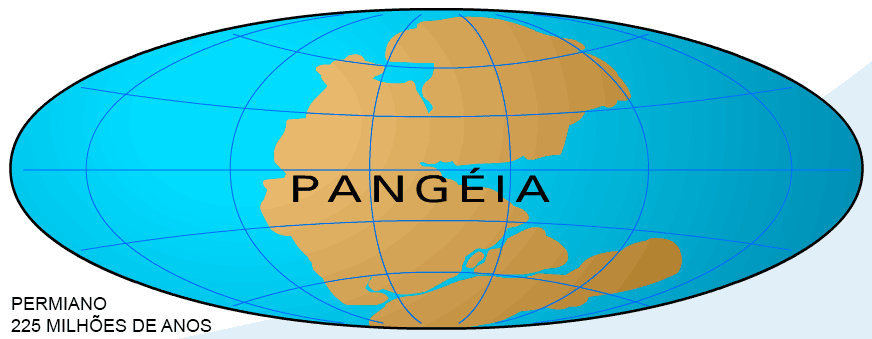{ .stretch }

- Então, a pangeia começa a se fragmentar em **massas de terra** emersas.

::: notes

REFERÊNCIAS:

- [IBGE | Atlas Escolar | a terra | formação dos continentes](https://atlasescolar.ibge.gov.br/a-terra/formacao-dos-continentes)

:::

---

### Evidências

- Linhas da costa Atlântica da América do Sul e da África que se encaixam;
- Fósseis encontrados nos dois continentes que viveram na mesma época;
- Formações rochosas coincidentes;

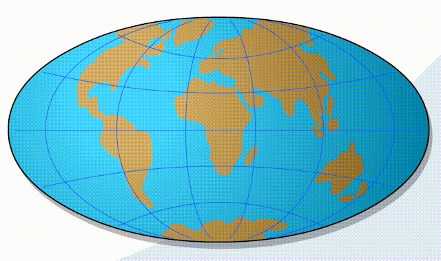{.stretch}

---

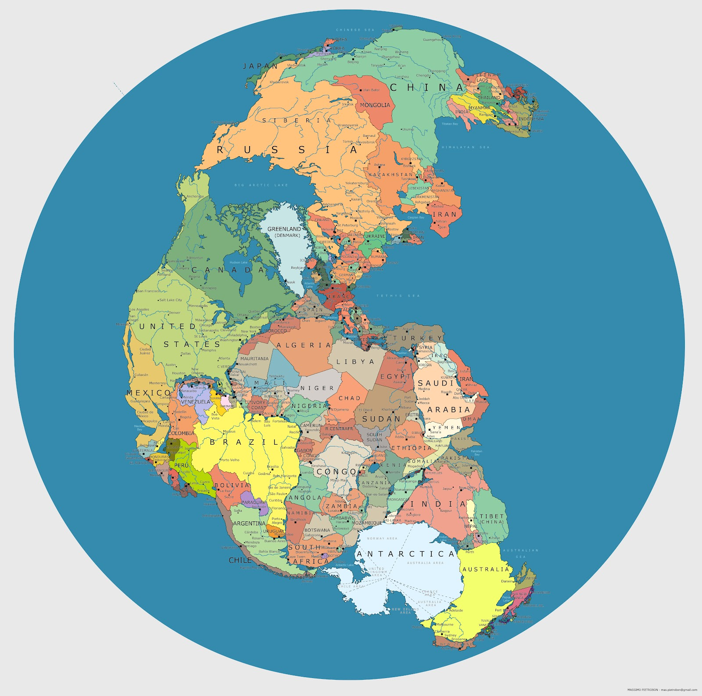{.stretch}

[Mapa da Pangeia mostra onde ficariam os países no supercontinente](https://www.nexojornal.com.br/expresso/2019/09/04/Este-mapa-mostra-onde-os-pa%C3%ADses-estariam-na-Pangeia)

::: notes

PARA IR ALÉM:

- [Este mapa mostra como a superfície do planeta mudou em 600 milhões de anos](https://dinosaurpictures.org/ancient-earth#0) ([1](https://www.nexojornal.com.br/expresso/2018/05/14/Este-mapa-mostra-como-a-superf%C3%ADcie-do-planeta-mudou-em-600-milh%C3%B5es-de-anos), [2 (inglês)](https://www.smithsonianmag.com/smart-news/map-lets-you-plug-your-address-see-how-neighborhood-has-changed-over-past-750-million-years-180971507/))

:::

---

## Tectônica de Placas

- A partir da **deriva continental**, a teoria da **tectônica de placas** se consolida nos anos 1960.
- A **crostra terrestre** é fragmentada em **placas tectônicas** que se movimentam devido a dinâmica interna da Terra (correntes de convecção).

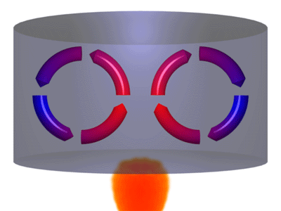{ .stretch }

---

### Limites entre as placas

- São áreas de instabilidade geológica. O deslocamento das placas provoca **dobramentos**, **falhas**, **vulcanismo** e **terremotos**.

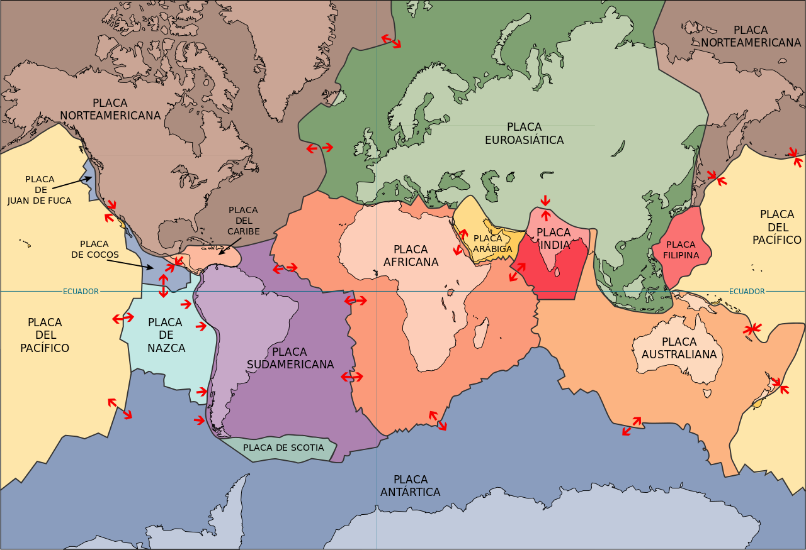{ .stretch }

---

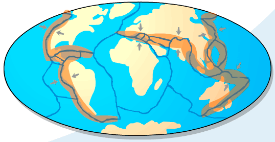{ .stretch }

<u>Limites convergente</u>: colidem, gerando fossas ou dobramentos

---

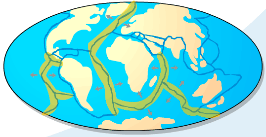{ .stretch }

<u>Limites Divergente</u>: se separam, trazendo magma

---

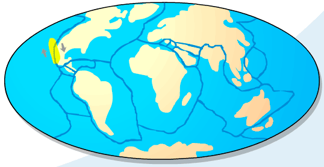{ .stretch }

<u>Limites Transformantes</u>: deslizam, gerando falhas

---

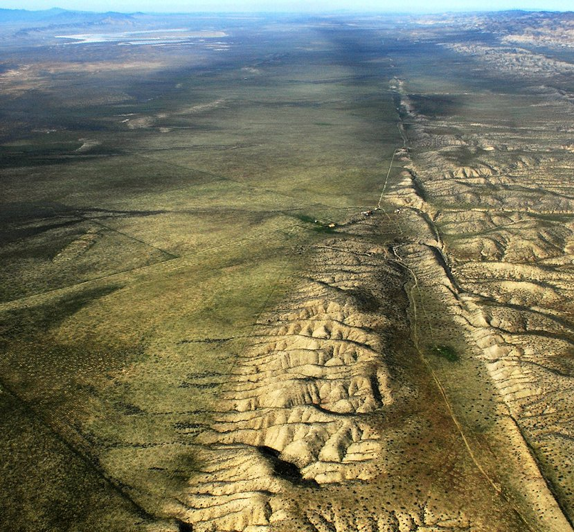{ .stretch }

[Falha de San Andreas](https://pt.wikipedia.org/wiki/Falha_de_Santo_Andr%C3%A9)

---

## Estrutura geológica da Terra

- É o conjunto de diferentes rochas de um lugar e os processos geológicos sofridos por elas. 
- São as estruturas: **Escudos** (Escudo Brasileiro); **Bacias sedimentares** (Amazônica, do Paraná, do Pantanal e do Maranhão); **Dobramentos** (Cordilheira dos Andes).

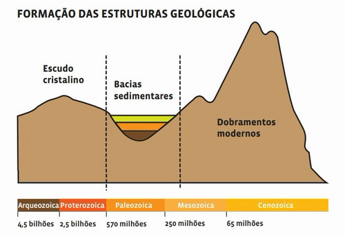

::: notes

- <u>Escudos</u>: primeiros núcleos de rochas que surgiram. São planaltos baixos ou depressões - formados por rochas magmáticas e metamórficas.
- <u>Bacias sedimentares</u>: depressões preenchidas com sedimentos dos escudos. São a maior parte da superfície emersa da Terra. Aqui são encontrados combustíveis fósseis - **carvão** e **petróleo**.
- <u>Dobramentos</u>: terrenos elevados produzidos pela tectônica de placas. Geralmente ficam na borda dos continentes. 

:::

---

### Estrutura geológica no Brasil

- O Brasil está inserido na Plataforma **Sul-Americana**. Apresenta **escudos cristalinos**, **bacias sedimentares** e **dobramentos antigos**.
- Nossos recursos minerais estão diretamente relacionados com nossa geologia.
  - <u>Terrenos arqueozóicos</u>: **Complexo Cristalino Brasileiro** - rochas magmáticas (granito) e metamórficas (gnaisse);
  - <u>Terrenos proterozoicos</u>: onde estão nossas riquezas minerais - **ferro** (hematita), **manganês** (pirolusita), **estanho** (cassiterita), **alumínio** (bauxita), **ouro**, **cobre**, entre outros;

---

## Tipos de rochas

- As **rochas** são compostas por grupos (diferentes ou não) de grãos de minerais agregados.
- Dividem-se pela sua origem em:
  - <u>Magmáticas</u>: magma solidificado. Ex.: **granito**, **basalto**;
  - <u>Sedimentares</u>: decomposição e deposição de sedimentos de outras rochas ou detritos orgânicos. Ex.: **calcário**, **carvão**, **sal;**
  - <u>Metamórficas</u>: alteração de outras rochas por meio de altas pressões e temperaturas. Ex.: **mármore** (vem do calcário), **gnaisse** (do granito);

::: notes

- <u>Magmáticas</u>: **plutônicas** (resfriamento lento do magma) ou **vulcânicas** (solidificação rápida da lava - magma na superfície)
- <u>Sedimentares</u>: **detríticas** (outras rochas) ou **químicas** (orgânicas por acumulo ou inorgânicas por decomposição)

:::

---

## Agentes do relevo 

- O **relevo** é fruto de duas forças opostas: **endógena** (interna) e **exógena** (externa).

---

### Agentes endógenos (formadores do relevo)

- <u>Tecnonismo</u>: deslocam e deformas rochas, formando a crosta. Geram as **falhas** e **montanhas**;
- <u>Vulcanismo</u>: extravasamento do magma na superfície através das **fendas**, **fissuras** ou **corpos vulcânicos**;
- <u>Abalos sísmicos</u>: movimento da superfície terrestre por meio de vibrações que provocam **deslocamentos**, **falhamentos**, **terremoto** (terra), **maremoto** (mar);

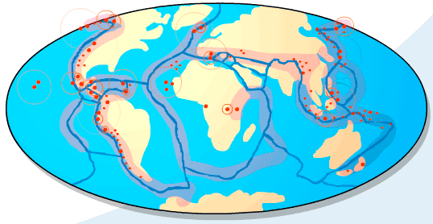{.stretch}

::: notes

- <u>Vulcanismo</u>: vulcões no planeta se concentram no **círculo de fogo do Pacífico** e **do Atlântico**
- <u>Abalos sísmicos</u>: suas causas são o **tectonismo**, **vulcanismo** e **desmoronamentos internos**. Ex.: falha de San Andreas (EUA)

:::

---

### Agentes exógenos (modeladores do relevo)

- Provocam o desgaste das rochas, transportando e depositando sedimentos (**erosão**).
  - <u>marítima</u>: linhas costeiras modeladas pelas águas do mar;
  - <u>glacial</u>: deslocamentos das geleiras;
  - <u>pluvial</u>: solos são desgastados e seu material carregado pelas águas da chuva;
  - <u>fluvial</u>: ação das águas dos rios, que transportam e acumulam material, formando **vales**, **cânions**, **planicies fluviais**, **deltas**;
  - <u>eólica</u>: mais atuânte em regiões desérticas e litorâneas e menos nas equatoriais. Vento "lixa" a rocha, acumulando e depositando em **dunas** e **solos de Loess** (muito finos e férteis);

---

## Formas de relevo

- <u>Montanhas</u>: maioria ligadas a **processos endógenos** (internos);
- <u>Planaltos</u>: resultantes de processos erosivos prolongados;
- <u>Depressões</u>: abaixo do nível do mar (**absolutas**) ou dos terrenos ao redor (**relativas**);
- <u>Planicies</u>: grande extensão de terreno plano ou ondulado, pouco elevado acima do nível do mar;

---

### Formas de relevo no Brasil

- Por ser antigo, nosso relevo vem sofrendo açõa dos **agentes externos** (água e vento), e também não apresenta altas altitudes.
- Nas **regiões úmidas**, temos formas mais suaves e arredondas, modeladas pelas águas das chuvas, rios e cachoeiras. Ex.: serras do sudeste.
- As **regiões áridas** possuem formas mais abruptas, causadas pela desagregação das rochas e chuvas fortes e irregulares. Ex.: sertão nordestino.
- Os rios da grande rede hidrográfica brasileira são importantes agentes de erosão e sedimentação.

::: notes

PARA IR ALÉM:

- [Terra moldada por cheias e queimadas](https://revistapesquisa.fapesp.br/terra-moldada-por-cheias-e-queimadas/) - Água e, em menor escala, fogo influenciam a distribuição e a diversidade de plantas no Pantanal

:::

---

- Relevos predonimantes: **planaltos**, **planícies** e **depressões relativas**.
- Alguns específicos: **serras** (dobramentos, escarpas de planaltos); **chapadas** (planalto sedimentar, de topo plano e encontas escarpadas); **inselbergs** (saliências rochosas em regiões de clima mais árido); **cuestas** (um lado escarpado e outro com declive suave).

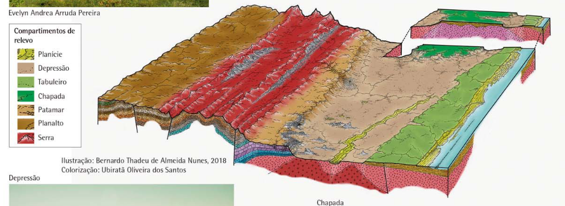{.stretch}

::: notes

REFERÊNCIAS:

- [IBGE | Relevo - Unidades de relevo](https://atlasescolar.ibge.gov.br/images/atlas/mapas_brasil/brasil_unidades_de_relevo.pdf)

:::

---

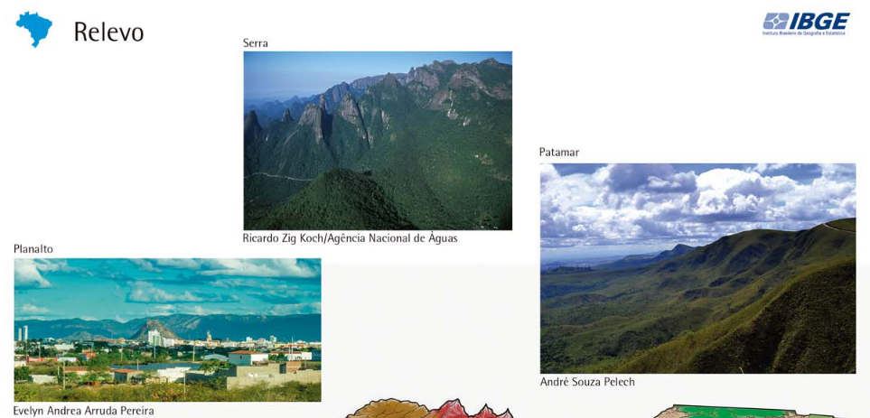{.stretch}

---

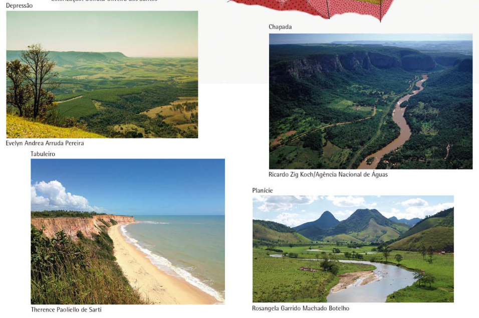{.stretch}

---

## Solos

- O **solo** é a camada mais superficial da crosta terrestre, e é resultado do **intemperismo**.
- **Intemperismo** consiste na alteração das rochas ao ter contao com os seguintes agentes: **água**, **ar**, **mudança de temperatura** e **seres vivos.**
  - Fatores: **clima** (variação sazonal da temperatura e distribuição das chuvas); **relevo** (infiltração e drenagem das águas pluviais); **fauna e flora** (matéria orgânica para reações químicas); **rocha parental** (sua resistência); **tempo de exposição** da rocha aos agentes.

---

- A **Pedogênese** (formação dos solos) ocorre quando modificações causadas pelo intemperismo tornam-se estruturais, com os minerais reorganizados. Depois a fauna e a flora **modificam e movimentam materiais**, mantendo o solo aerado e renovado.
- Os dois processos formam o **perfil do solo**, estruturado sobre a rocha matriz, formando o **manto de alteração**.

::: notes

PARA IR ALÉM:

- [Serviço Geológico do Brasil | Os Solos](http://www.cprm.gov.br/publique/Redes-Institucionais/Rede-de-Bibliotecas---Rede-Ametista/Os-Solos-2620.html)
- [Geoideias | Intemperismo e Erosão](https://geoideias.com.br/?p=299)

:::

---

### Solos brasileiros

- Clima predominantemente **tropical úmido** e a estabilidade estrutural (sem grandes alterações desde muito tempo) faz com que a formação da cobertura dos nossos solos sejam marcados principalmente pelo **fator climático**.
- O clima tropical também influencia a ação das chuvas no "envelhecimento" (**acidificação**) do solo.
- **Latossolos** são o tipo mais representativo. Possuem coloração avermelhada, acidez elevada e ricos em argilominerais, óxidos de ferro e alumínio.

---

## Degradação

- A má utilização pode gerar a perda dos solos, que é recurso **não renovável**.
- Principais problemas: **lixiviação** (perda de sais minerais pela água das chuvas); **laterização** (lixiviação do solo em área chovosa e rica em ferro e alumínio, formando uma crosta); **esgotamento dos solos** (plantio inadequado torna estéreis áreas cultiváveis); **salinização** (alta evaporação em áreas irrigadas, acumulando sais no solo, tornando-a improdutiva); **erosão** (desgate e perda de detritos com a ação das chuvas e ventos);

---

- A **erosão** é o **principal problema ambiental** relacionados aos solos, podendo ser previnida com a proteção de cobertura vegetal.
  - Alta erosão dos solos causam: **assoreamento** (acumulo de sedimentos) de rios e nascentes, formação de **voçorocas** (grandes buracos de erosão), **ravinas**, e **deslizamento de encostas**.
- Algumas práticas de prevenção e até reversão dos processos de degradação são: **rotação de culturas**, **terraceamento**, **curvas de nível** e **calagem**.

---

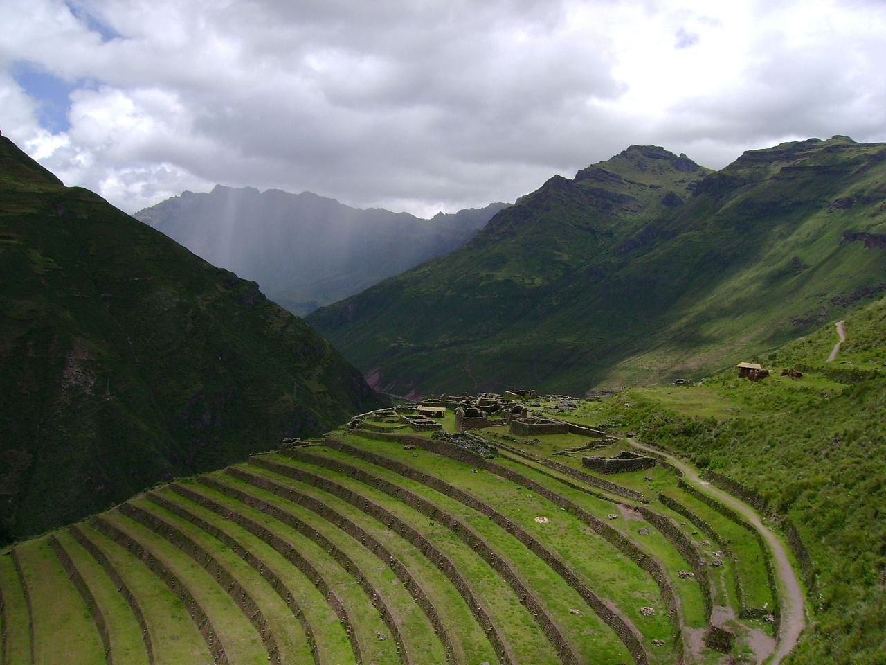

[Terraços agrícolas no Peru, criados pelo Império Inca](https://pt.wikipedia.org/wiki/Terraceamento)

---

### Desertificação

- Processo que vem tomando grandes proporções e que provoca impactos ambientais, sociais e econômicos.
- **Desertificação** é a degradação do solo nas regiões mais secas em decorrência das variações climáticas e atividades humanas. - Agenda 21
  - Principais causas segundo as Nações Unidas: **sobrepastoreio**, **salinização** por irrigação e **processos de uso intensivo** sem manejo adequeado.

::: notes

- Impactos ambientais: destruição da fauna e da flora, redução dos recursos hídricos (assoreamento), perda química e física dos solos.
  - Gera perda na capacidade produtiva, provocando mudanças sociais como migrações (campo pra cidade por ex.).

PARA IR ALÉM:

- [Brasil Escola | Desertificação](https://brasilescola.uol.com.br/geografia/desertificacao.htm)

:::

---

- Ações de degradação induzidas pelo homem, segundo a FAO:
  - das **populações animais e vegetais** (caça e extração de madeira); do **solo** (fisica - erosão e compactação pela mecanização - ou química - salinização); das **condições hidrológicas** da superfícia (perda da cobertura vegetal); das **condições geo-hidrológicas** das águas subterrâneas (modificação nas condições de recarga); da **infraestrutura econômica** e **qualidade de vida** dos assentamentos humanos.

# Referências

##

- O conteúdo desta aula foi baseado principalmente nas [apostilas do Me Salva!](https://www.mesalva.com/), bem como outras referências citadas nos slides.
  - [Geografia ENEM: Volume I](https://materiais.mesalva.com/apostila-geografia-enem-vol1), 1. Cartografia; [Geografia ENEM: Volume II](https://materiais.mesalva.com/apostila-geografia-enem-vol2), 4. Geomorfologia
  - Também disponível no [canal do telegram do Me Salva](https://t.me/mesalva/10)!