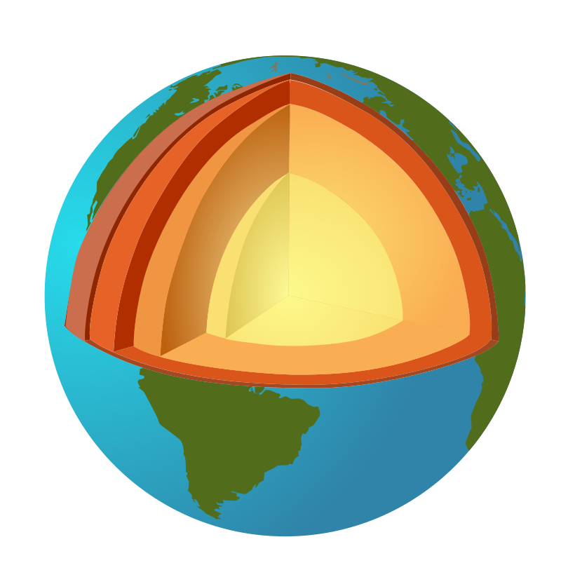

# Cartografia

---

## Sobre a cartografia

A cartografia é a arte de conceber, levantar, redigir e divulgar os mapas

    Segundo definição da UNESCO em 1966. Segundo a Associação Cartográfica Internacional, a cartografia compreende "o conjunto dos estudos e das operações científicas, artísticas e técnicas que intervêm a partir dos resultados de observações diretas ou da exploração de uma documentação, em vista da elaboração e do estabelecimento de mapas, planos e outros modos de expressão, assim como de utilização"

::: notes

Porque mapear e pra que serve?

História

    A história da Cartografia mostra a evolução de um conhecimento sistematizado, com influências de diversas culturas, com múltiplos objetivos e fruto de muitas conquistas científicas e tecnológicas ao longo do tempo.

Um mapa é como um texto

    utiliza de uma linguagem para transmitir uma mensagem. A cartografia veio antes da escrita em algumas sociedades.

Conhecer e representar a Terra foram os primeiros objetivos da Geografia

    Os homens sempre procuraram conservar a memória dos lugares e caminhos úteis às suas ocupações. Aprenderam a gravar os seus detalhes em placas de argila, madeira ou metal, ou a desenhá-los nos tecidos, nos papiros e nos pergaminhos, utilizaram-se dos instrumentos construtivos ou pictóricos de que dispunham, em diferentes culturas e em distintos momentos históricos, para registrar territórios.

Conhecimento geográfico é conhecimento estratégico

    Informações cartográficas são base sobre as quais se tomam decisões e encontram soluções para problemas sócio-econômicos e técnicos e se constitui, assim, importante ferramenta para o planejamento e a gestão. (Yves Lacoste)

Instrumento de dominação e resistência

    A cartografia foi (e é) usada como instrumento de dominação por Estados e grandes empresas. Quem elabora o mapa tem o poder da linguagem, seja esse poder repressor e dominador ou de luta e resistência. Por exemplo: um mapa como instrumento de embates, como na questão da demarcação da terras indígenas e quilombolas, ou seja, a reconquista de territórios a partir dos grupos usurpados que lutam por seus direitos. (cartografia crítica)

:::

---

## Leitura de mapas

- O mapa é um instrumento criado para responder à questão "onde estou?", "onde está tal objeto?"
- Características básicas do mapa: a **localização e atributos**; a **escala** e a **projeção cartográfica**

---

### Localização e Atributos

::: {.columns}
::: {.column}

Os mapas são elaborados a partir de uma posição no espaço e uma qualidade/quantidade

    A localização é dada por suas posições no espaço (coordenadas geográficas) bidimensional ou tridimensional. Os atributos são as qualidades ou magnitudes, ou ainda uma variável temática, como temperatura, tipo de solo, tipos de religiões, aspectos econômicos etc.

:::
::: {.column}

:::
:::

::: notes

Meridianos e paralelos

    Os meridianos são linhas imaginárias que cortam a Terra no sentido norte–sul, ligando um polo ao outro. Os parale­los são linhas imaginárias que circulam a Terra no sentido leste–oeste. Paralelos e meridianos são definidos por suas dimensões de latitude e longitude, respectivamente.

Latitute

    Os paralelos nos indicam a latitude, que é a distância, em graus, da linha do Equador até o paralelo de um determinado lugar. Os valores da latitude variam de 0o (linha do Equador) a 90o (polos), devendo ser indicada também a posição: no hemisfério sul (S) ou no hemisfério norte (N).

Longitude

    A longitude é a distância, em graus, entre o meridiano de origem e o meridiano local. Por convenção, adotou­-se como origem o Meridiano de Greenwich (que passa pelo observatório de Greenwich na Inglaterra).

PARA IR ALÉM:

[coordenadas geográficas | Atlas escolar IBGE](https://atlasescolar.ibge.gov.br/conceitos-gerais/o-que-e-cartografia/coordenadas-geogra-ficas.html)

:::

---

### Escala

Os mapas são representações reduzidas e simplificadas do mundo real.

    Ao se definir a relação dimensional entre a representação gráfica e a realidade, caracteriza-se a escala. Toda vez que se decide fazer a representação gráfica de uma porção do ambiente, a primeira coisa a ser feita é escolher a escala do mapa

---

### Projeções cartográficas

Todo mapa revela uma determinada visão de mundo!

::: {.columns}
::: {.column width="40%"}

- Mantém forma (ângulos) e não proporção (áreas distorcidas)
- Eurocentrismo

:::
::: {.column width="60%"}

- Alterou formas para manter proporção

- Valorização do mundo subdesenvolvido

:::
:::

::: notes

Nenhum mapa será exato, geometricamente semelhante à figura que se deseja representar. Sempre haverá deformação. Assim, a procura de soluções cartográficas para a melhor aproximação é estudada nas projeções cartográficas (NOGUEIRA, 2008).

[as projeções cartográficas | Atlas escolar IBGE](https://atlasescolar.ibge.gov.br/conceitos-gerais/o-que-e-cartografia/as-projec-o-es-cartogra-ficas.html)

PARA IR ALÉM:

[Ouça | Podterritorial - Podcast Unesp](https://podcast.unesp.br/15548/podterritorial-professor-da-unesp-explica-o-que-e-cartografia-geografica-critica)

    Eduardo Paulon Girardi, especialista em geografia agrária da Unesp em Presidente Prudente e membro da Rede Dataluta, explica o que é Cartografia Geográfica Crítica.

:::

---

## Tecnologias

---

### GNSS (GPS)

**Sistema Global de Navegação por Satélite** (GNSS) refere­-se à cons­telação de satélites que possibilita o posicionamento em tempo real de objetos, bem como a navegação em terra ou mar.

    Esses sistemas são utilizados em diversas áreas, como mapeamentos topográficos e geodésicos, aviação, navegação marítima e terrestre, monitoramen­to de frotas, demarcação de fronteiras, agricultura de precisão, entre outros usos.

::: notes

O sistema NAVSTAR-­GPS, desenvolvido e controlado pelo Departa­mento de Defesa dos Estados Unidos – inicialmente para fins militares e posteriormente aberto para uso civil –, até hoje é o sistema mais utilizado no mundo.

[gnss | Atlas escolar IBGE](https://atlasescolar.ibge.gov.br/conceitos-gerais/o-que-e-cartografia/sistema-global-de-navegac-a-o-por-sate-litess.html)

:::

---

### Sensoriamento Remoto

O sensoriamento remoto é a técnica de obtenção de infor­mações acerca de um objeto, área ou fenômeno localizado na Terra, sem que haja contato físico com o mesmo.

    As informa­ções podem ser obtidas através de radiação eletromagnética, gerada por fontes naturais (sensor passivo), como o Sol, ou por fontes artificiais (sensor ativo), como o radar. São apresentadas na forma de imagens, sendo mais utilizadas, atualmente, aque­las captadas por sensores óticos orbitais localizados em satélites.

---

As imagens orbitais possibilitam muitas aplicações, como o mapeamento e a atualização de dados cartográficos e temáticos, a produção de dados meteorológicos e a avaliação de impactos ambientais.

::: notes

PARA IR ALÉM

[Fakegeo: como mentir com imagens de satélite - Outras Palavras](https://outraspalavras.net/geopoliticaeguerra/fakegeo-como-mentir-com-imagens-de-satelite/)

    Você sabe se essa imagem é verdadeira? No mundo das plataformas, surge nova forma de falseamento – seja por imagens criadas virtualmente ou até pela falta de atualização. Como formar jornalistas para checagem dessa linguagem essencial?

:::

---

### O “Hack” do Google Maps

Google Maps faz mudanças virtuais na cidade real

    O Airbnb impactam mercado imobiliário das cidades; O Tinder impacta como conhecemos parceiros e parceiras; O iFood e o Uber fazem transporte de pessoas e alimentos; Todos esses aplicativos criam novas formas de capitalismo digital e Comoditização (transformação de bens e serviços em *commoditys*, ou seja, bens/produtos em seu estado "bruto", que têm preço determinado apenas pela oferta e a procura.)

<iframe width="560" height="315" src="https://www.youtube-nocookie.com/embed/k5eL_al_m7Q" title="YouTube video player" frameborder="0" allow="accelerometer; autoplay; clipboard-write; encrypted-media; gyroscope; picture-in-picture" allowfullscreen>
</iframe>

::: notes

[Google Maps Hacks | SIMON WECKERT](http://www.simonweckert.com/googlemapshacks.html)

:::

---

## Referências e materiais complementares

[o que é cartografia? | Atlas escolar IBGE](https://atlasescolar.ibge.gov.br/conceitos-gerais/o-que-e-cartografia)

# Geomorfologia

---

## Camadas da Terra

:::: {.columns}
::: {.column width="60%"}

**Núcleo**: sólido - composto por ligas metálicas

    Constituído por ferro misturado com outros elementos (níquel, silício e carbono). Possui altas temperaturas e está dividido em núcleo externo (líquido) e núcleo interno (sólido).

**Manto**: pastoso - rochas derretidas;

    Camada intermediária, o manto é composto de material de maior densidade, possuindo em sua composição ferro, magnésio e silício. É nessa região que se encontra um material pastoso denominado magma.

**Crosta**: oceânica e continental.

    Das três camadas que compõem a estrutura interna da Terra, a crosta terrestre é a mais superficial e menos densa de todas. Também conhecida como litosfera. Trata-se de uma camada descontínua, formada por fragmentos que flutuam sobre o manto, gerando incessante atividade geológica na superfície terrestre (tectonismo).

:::
::: {.column width="40%"}

:::
::::

---

## Teoria da deriva continental

Há 250 milhões de anos, os continentes estavam agrupados em um único (<u>pangeia</u>). Então, a pangeia começa a se fragmentar em **massas de terra** emersas.

<object data="assets/morfo_a-crosta-em-movimento.pdf" type="application/pdf"></object>

::: notes

[formação dos continentes | Atlas escolar IBGE](https://atlasescolar.ibge.gov.br/a-terra/formacao-dos-continentes)

:::

---

### Evidências

- Linhas da costa Atlântica da América do Sul e da África que se encaixam;
- Fósseis encontrados nos dois continentes que viveram na mesma época;
- Formações rochosas coincidentes;

---

[Mapa da Pangeia mostra onde ficariam os países no supercontinente](https://www.nexojornal.com.br/expresso/2019/09/04/Este-mapa-mostra-onde-os-pa%C3%ADses-estariam-na-Pangeia)

::: notes

PARA IR ALÉM:

[Este mapa mostra como a superfície do planeta mudou em 600 milhões de anos](https://dinosaurpictures.org/ancient-earth#0) ([matéria | Nexojornal](https://www.nexojornal.com.br/expresso/2018/05/14/Este-mapa-mostra-como-a-superf%C3%ADcie-do-planeta-mudou-em-600-milh%C3%B5es-de-anos))

:::

---

## Tectônica de Placas

- A partir da **deriva continental**, a teoria da **tectônica de placas** se consolida nos anos 1960.
- A **crostra terrestre** é fragmentada em **placas tectônicas** que se movimentam devido a dinâmica interna da Terra (correntes de convecção).

---

### Limites entre as placas

- São áreas de instabilidade geológica. O deslocamento das placas provoca **dobramentos**, **falhas**, **vulcanismo** e **terremotos**.

---

<u>Limites Convergentes</u>: colidem, gerando fossas ou dobramentos

---

<u>Limites Divergentes</u>: se separam, trazendo magma

---

<u>Limites Transformantes</u>: deslizam, gerando falhas

---

[Falha de San Andreas](https://pt.wikipedia.org/wiki/Falha_de_Santo_Andr%C3%A9)
