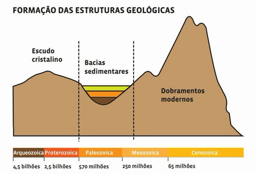
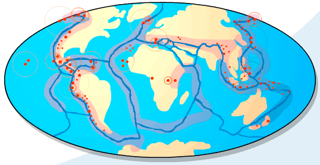
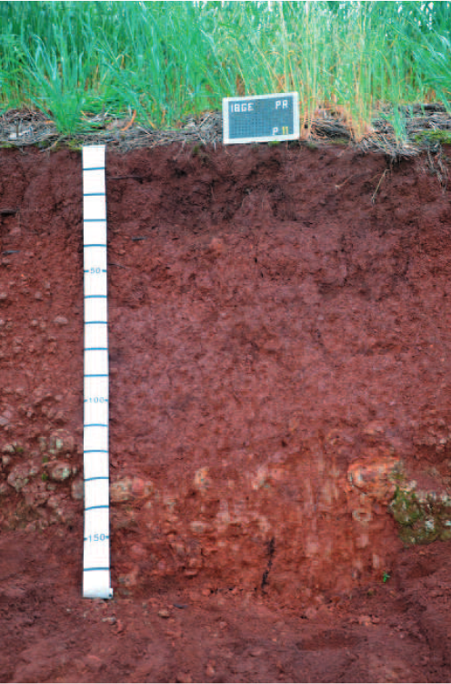

# Geomorfologia (continuação, ver [Aula 02](../aula02/aula02.html#geomorfologia))

## Estrutura geológica da Terra

- É o conjunto de diferentes rochas de um lugar e os processos geológicos sofridos por elas. 

::: notes

- <u>Escudos</u>: primeiros núcleos de rochas que surgiram. São planaltos baixos ou depressões - formados por rochas magmáticas e metamórficas. Ex: Escudo Brasileiro
- <u>Bacias sedimentares</u>: depressões preenchidas com sedimentos dos escudos. São a maior parte da superfície emersa da Terra. Aqui são encontrados combustíveis fósseis - **carvão** e **petróleo**. Ex: Bacia Amazônica
- <u>Dobramentos</u>: terrenos elevados produzidos pela tectônica de placas. Geralmente ficam na borda dos continentes. Ex: Cordilheira dos Andes

:::

---

### Estrutura geológica no Brasil

- O Brasil está inserido na Plataforma **Sul-Americana**. Apresenta **escudos cristalinos**, **bacias sedimentares** e **dobramentos antigos**.

<object data="assets/morfo_mapa-estrutura-geologica.pdf" type="application/pdf"></object>

::: notes

- Nossos recursos minerais estão diretamente relacionados com nossa geologia.
  - <u>Terrenos arqueozóicos</u>: **Complexo Cristalino Brasileiro** - rochas magmáticas (granito) e metamórficas (gnaisse);
  - <u>Terrenos proterozoicos</u>: onde estão nossas riquezas minerais - **ferro** (hematita), **manganês** (pirolusita), **estanho** (cassiterita), **alumínio** (bauxita), **ouro**, **cobre**, entre outros;

:::

---

## Agentes do relevo 

- O **relevo** é fruto de duas forças opostas: **endógena** (interna) e **exógena** (externa).

<iframe width="560" height="315" src="https://www.youtube-nocookie.com/embed/hJ54uEwJLK0" title="YouTube video player" frameborder="0" allow="accelerometer; autoplay; clipboard-write; encrypted-media; gyroscope; picture-in-picture" allowfullscreen>
</iframe>

---

### Agentes endógenos (formadores do relevo)

<u>Tectonismo</u>: deslocamentos lentos das placas tectônicas

  Deslocam e deformam rochas, formando a crosta. Geram as falhas e montanhas

<u>Vulcanismo</u>: extravasamento do magma na superfície através das fendas, fissuras ou corpos vulcânicos

  Nos pontos de encontro das placas tectônicas, são explosivos (Círculo de Fogo do Pacífico). Já quando acontecem no meio de uma placa, são não explosivos (Havaí)

<u>Abalos sísmicos</u>: movimento da superfície terrestre por meio de vibrações

  Provocam deslocamentos, falhamentos, terremoto (terra), maremoto (mar). Propagam-se a partir do hipocentro (área de contato entre as placas), atingindo regições distantes do epicentro (ponto de contato com a superfície)

---

### Agentes exógenos (modeladores do relevo)

- <u>Erosão</u>: desgaste, transporte e acumulo de sedimentos
- <u>Intemperismo</u>: processos que transformam as rochas
- <u>Ação antrópica</u>: transformação dos espaços naturais

<iframe width="560" height="315" src="https://www.youtube-nocookie.com/embed/E9oeChbKvwI" title="YouTube video player" frameborder="0" allow="accelerometer; autoplay; clipboard-write; encrypted-media; gyroscope; picture-in-picture" allowfullscreen>
</iframe>

::: notes

- Erosão
  - <u>marítima</u>: linhas costeiras modeladas pelas águas do mar;
  - <u>glacial</u>: deslocamentos das geleiras;
  - <u>pluvial</u>: solos são desgastados e seu material carregado pelas águas da chuva; - <u>fluvial</u>: ação das águas dos rios, que transportam e acumulam material, formando **vales**, **cânions**, **planicies fluviais**, **deltas**;
  - <u>eólica</u>: mais atuânte em regiões desérticas e litorâneas e menos nas equatoriais. Vento "lixa" a rocha, acumulando e depositando em **dunas** e **solos de Loess** (muito finos e férteis);
- Intemperismo
  - <u>Físico</u>: variação de temperaturas entre o dia e a noite e também nas estações do ano
  - <u>Químico</u>: associado com a ação das águas
  - <u>Biológico</u>: a partir da ação de seres vivos, como bactérias e animais
- Ação antrópica
  - Construir cidades; desviar cursos de rios; derrubada de florestar
  - Ação humana altera e acelera ciclo natural

:::

---

## Formas de relevo

- <u>Montanhas</u>: maioria ligadas a **processos endógenos** (internos);
- <u>Planaltos</u>: resultantes de processos erosivos prolongados;
- <u>Depressões</u>: abaixo do nível do mar (**absolutas**) ou dos terrenos ao redor (**relativas**);
- <u>Planicies</u>: grande extensão de terreno plano ou ondulado, pouco elevado acima do nível do mar;

---

### Formas de relevo no Brasil

- Por ser antigo, nosso relevo vem sofrendo açõa dos **agentes externos** (água e vento), e também não apresenta altas altitudes.

<object data="assets/morfo_unidades-relevo-brasil.pdf" type="application/pdf"></object>

::: notes

- Nas **regiões úmidas**, temos formas mais suaves e arredondas, modeladas pelas águas das chuvas, rios e cachoeiras. Ex.: serras do sudeste.
- As **regiões áridas** possuem formas mais abruptas, causadas pela desagregação das rochas e chuvas fortes e irregulares. Ex.: sertão nordestino.
- Os rios da grande rede hidrográfica brasileira são importantes agentes de erosão e sedimentação.

PARA IR ALÉM:

- [Terra moldada por cheias e queimadas](https://revistapesquisa.fapesp.br/terra-moldada-por-cheias-e-queimadas/) - Água e, em menor escala, fogo influenciam a distribuição e a diversidade de plantas no Pantanal

:::

---

- Relevos predonimantes: **planaltos**, **planícies** e **depressões relativas**.

<object data="assets/morfo_mapa-relevo-brasil.pdf" type="application/pdf"></object>

::: notes

- Alguns específicos: **serras** (dobramentos, escarpas de planaltos); **chapadas** (planalto sedimentar, de topo plano e encontas escarpadas); **inselbergs** (saliências rochosas em regiões de clima mais árido); **cuestas** (um lado escarpado e outro com declive suave).

:::

---

## Solos

- O **solo** é a camada mais superficial da crosta terrestre (litosfera), e é resultado do **intemperismo**.
- **Intemperismo** consiste na alteração das rochas ao ter contao com outros agentes: **água**, **ar**, **mudança de temperatura** e **seres vivos**

::: notes

- Tipos de solo
  - <u>Eluviais</u>: decomposição de rochas no próprio local de formação
  - <u>Aluviais</u>: acúmulo de material transportado pela água e vento
- Fatores do intemperismo
  - **Clima**: variação sazonal da temperatura e distribuição das chuvas
  - **Relevo**: infiltração e drenagem das águas pluviais
  - **Fauna e flora**: matéria orgânica para reações químicas
  - **Rocha parental**: sua resistência
  - **Tempo de exposição**: da rocha aos agentes

:::

---

:::::: {.columns}
::: {.column width="40%"}

:::
::: {.column width="60%"}

- A **Pedogênese** (formação dos solos) ocorre quando modificações causadas pelo intemperismo tornam-se estruturais, com os minerais reorganizados.
Depois a fauna e a flora **modificam e movimentam materiais**, mantendo o solo aerado e renovado.
- Os dois processos formam o **perfil do solo**, estruturado sobre a rocha matriz, formando o **manto de alteração**.

:::
::::::

::: notes

PARA IR ALÉM:

- [Os Solos | Serviço Geológico do Brasil](http://www.cprm.gov.br/publique/Redes-Institucionais/Rede-de-Bibliotecas---Rede-Ametista/Os-Solos-2620.html)
- [Formação do Solo | Youtube](https://www.youtube.com/watch?v=7XllpANht3Y)

:::

---

### Solos brasileiros

- Clima predominantemente **tropical úmido** e a estabilidade estrutural (sem grandes alterações desde muito tempo) faz com que a formação da cobertura dos nossos solos sejam marcados principalmente pelo **fator climático**.

<object data="assets/morfo_mapa-solos-brasil.pdf" type="application/pdf"></object>

::: notes

- O clima tropical também influencia a ação das chuvas no "envelhecimento" (**acidificação**) do solo.
- **Latossolos** são o tipo mais representativo. Possuem coloração avermelhada, acidez elevada e ricos em argilominerais, óxidos de ferro e alumínio.

:::

---

## Degradação

- A má utilização pode gerar a perda dos solos, que é recurso **não renovável**.
- A **erosão** é o **principal problema ambiental** relacionados aos solos, podendo ser previnida com a proteção de cobertura vegetal.
  - Alta erosão dos solos causam: **assoreamento** (acumulo de sedimentos) de rios e nascentes, formação de **voçorocas** (grandes buracos de erosão), **ravinas**, e **deslizamento de encostas**.

<iframe width="560" height="315" src="https://www.youtube-nocookie.com/embed/p8ucewKmEOA" title="YouTube video player" frameborder="0" allow="accelerometer; autoplay; clipboard-write; encrypted-media; gyroscope; picture-in-picture" allowfullscreen>

[Degradação do Solo](https://www.youtube.com/watch?v=p8ucewKmEOA)

</iframe>

---

- Principais problemas: **lixiviação** (perda de sais minerais pela água das chuvas); **laterização** (lixiviação do solo em área chovosa e rica em ferro e alumínio, formando uma crosta); **esgotamento dos solos** (plantio inadequado torna estéreis áreas cultiváveis); **salinização** (alta evaporação em áreas irrigadas, acumulando sais no solo, tornando-a improdutiva); **erosão** (desgate e perda de detritos com a ação das chuvas e ventos);
- Algumas práticas de prevenção e até reversão dos processos de degradação são: **rotação de culturas**, **terraceamento**, **curvas de nível** e **calagem**.

---

### Desertificação

Desertificação é a degradação do solo nas regiões mais secas em decorrência das variações climáticas e atividades humanas

  Principais causas segundo as Nações Unidas: **sobrepastoreio**, **salinização** por irrigação e **processos de uso intensivo** sem manejo adequeado.

<blockquote class="twitter-tweet">
Poucos sabem, mas existe um deserto do tamanho da Inglaterra no interior do Brasil  Só que, diferentemente de desertos naturais como o Saara ou o Atacama, o nosso foi criado pela ação humana e fica numa região densamente povoada  E pior: ele está se expandindo  Segue o fio: <a href="https://t.co/xw3aHgY9Rq">pic.twitter.com/xw3aHgY9Rq</a>
&mdash; João Fellet (@joaofellet) <a href="https://threadreaderapp.com/thread/1425426089120260102.html">August 11, 2021</a></blockquote> 
<!-- <a href="https://twitter.com/joaofellet/status/1425426089120260102?ref_src=twsrc%5Etfw">August 11, 2021</a></blockquote>   -->

::: notes

- Processo que vem tomando grandes proporções e que provoca impactos ambientais, sociais e econômicos.
- Impactos ambientais: destruição da fauna e da flora, redução dos recursos hídricos (assoreamento), perda química e física dos solos.
  - Gera perda na capacidade produtiva, provocando mudanças sociais como migrações (campo pra cidade por ex.).
- Ações de degradação induzidas pelo homem, segundo a FAO:
  - das **populações animais e vegetais** (caça e extração de madeira); do **solo** (fisica - erosão e compactação pela mecanização - ou química - salinização); das **condições hidrológicas** da superfícia (perda da cobertura vegetal); das **condições geo-hidrológicas** das águas subterrâneas (modificação nas condições de recarga); da **infraestrutura econômica** e **qualidade de vida** dos assentamentos humanos.

PARA IR ALÉM:

- [Brasil Escola | Desertificação](https://brasilescola.uol.com.br/geografia/desertificacao.htm)

:::

---

## Tipos de rochas

- As **rochas** são compostas por grupos (diferentes ou não) de grãos de minerais agregados.

<object data="assets/morfo_mapasrochas-brasil.pdf" type="application/pdf"></object>

::: notes

- <u>Magmáticas</u>: magma solidificado. Ex.: **granito**, **basalto**;
  - **plutônicas** (resfriamento lento do magma) ou **vulcânicas** (solidificação rápida da lava - magma na superfície)
- <u>Sedimentares</u>: decomposição e deposição de sedimentos de outras rochas ou detritos orgânicos. Ex.: **calcário**, **carvão**, **sal;**
  - **detríticas** (outras rochas) ou **químicas** (orgânicas por acumulo ou inorgânicas por decomposição)
- <u>Metamórficas</u>: alteração de outras rochas por meio de altas pressões e temperaturas. Ex.: **mármore** (vem do calcário), **gnaisse** (do granito);

:::

---