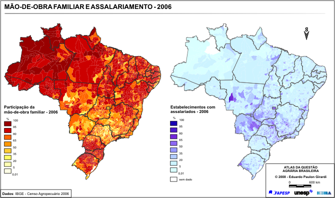
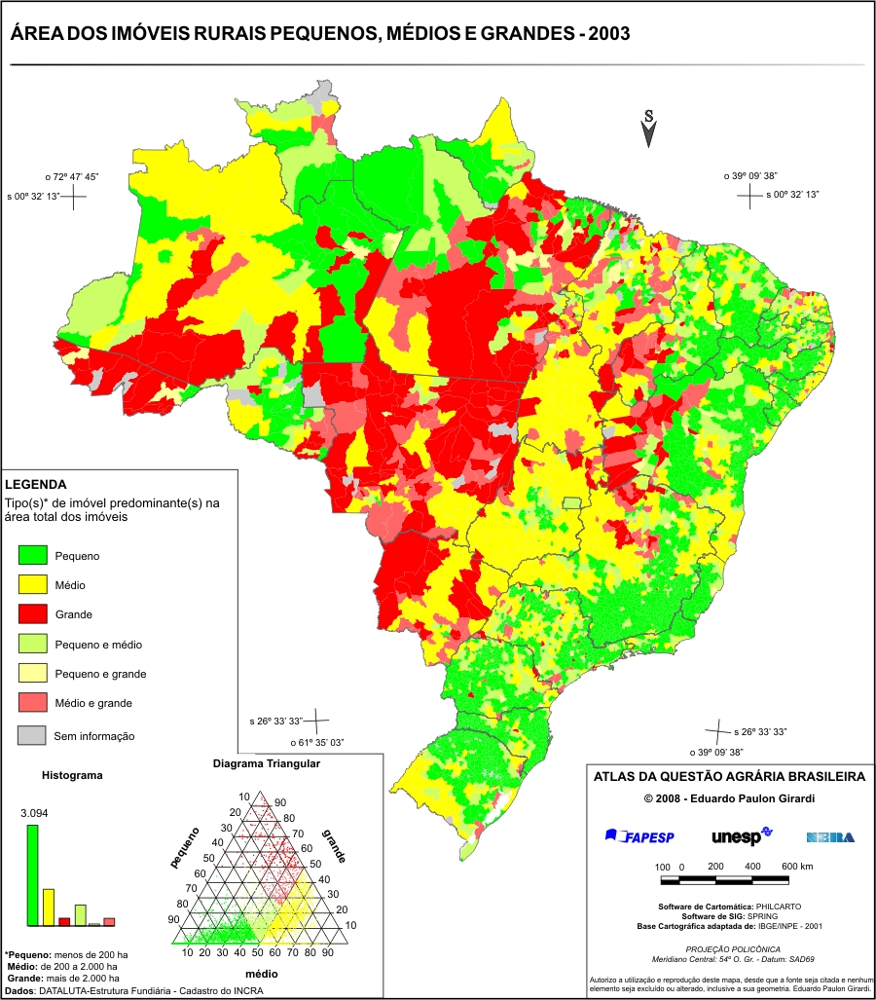
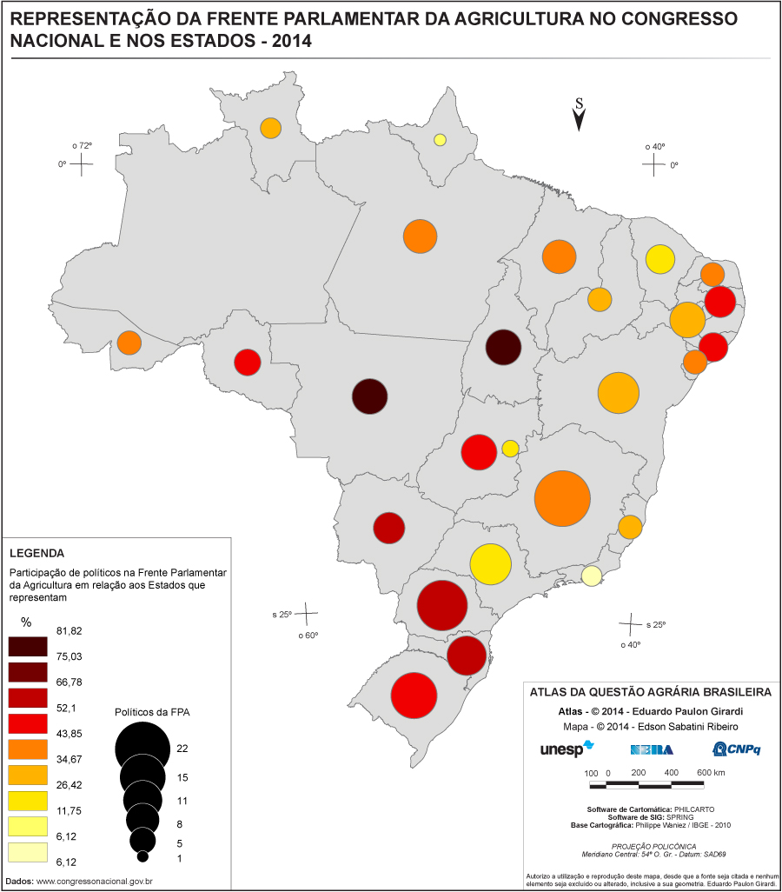
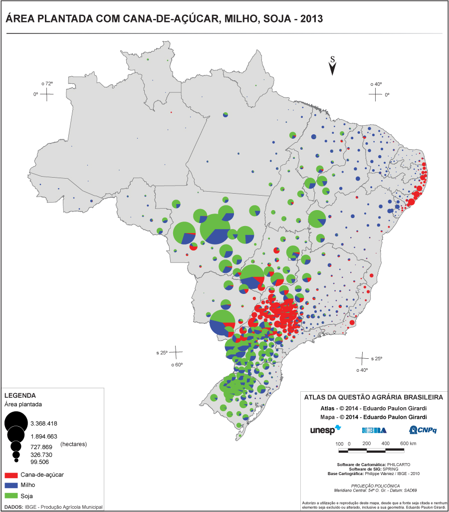

# Geografia agrária

## Espaço rural 

### Histórico

- <u>Primeira Revolução Agrícola</u> (Neolítico): **Domesticação de de plantas e animais** deu origem a uma forma sedentária de vida (antes, nômade); 
  - Técnicas de produção e criação permitiram o aumentando da capacidade produtiva. Causou aumento populacional e **produção de excedentes**.
- Excedente começaram a ser comercializados, originando primeiros **núcleos urbanos**, **atividade comercial**, atividades e profissões - <u>sociedades rurais</u>

---

### Espaço rural  - Histórico

:::::: {.columns}
::: {.column}

- Até a <u>Revolução Industrial</u>, base econômica das sociedades estava no **campo**. 
  1. Cidades eram lugar de **mercado** e **controle político militar**, estabelecendo relação de **oposição entre o campo e a cidade**. 
  2. Antes, camponeses **vendiam excedentes** da produção (policultura) nas <u>feiras</u> e <u>burgos</u>^1^

:::
::: {.column style="font-size: 85%;"}

- Posteriormente, agricultra alcança nível técnico e científico que permitiu **aumento de produção** por área de cultivo
  1. Desenvolvimento do <u>capitalismo</u> se deu com as cidades, **alterando relações entre as cidades e o campo**.
  2. <u>Sociedade industrial</u> passa a comandar o espaço geográfico. Campo passa a fornecer **matéria prima para indústrias** e os **alimentos para as cidades**, bem como a **mão de obra**.
  3. Produção para as cidades e competição pelo menor preço traz tendência à <u>monocultura</u> e especialização.

:::
::::::

::: notes

^1^ As <u>feiras</u> eram geralmente realizadas nos <u>burgos</u> (núcleos populacionais que surgiram nas cercanias dos castelos)

:::

---

### Espaço rural - Características

- Agropecuária capitalista atrelou produção agrícola ao meio urbano, aumentando a **dependência da indústria** para obtenção de insumos, sementes, adubos agrotóxicos, fertilizantes e máquinas - <u>industrialização da agropecuária</u>
- Agricultura possui alta **dependência dos meios naturais** (solos, climas, recursos hídricos). 

---

## A Agricultura

- A agricultura moderna capitalista se baseia em dois pontos: investimento de capital e produtividade - através do uso de insumos, maquinário e tecnologia.
  - Segue a lógica de mercado (<u>lei de oferta e procura</u>), sem levar em conta interesses sociais

---

### Sistemas

| Agricultura extensiva                                 | Agricultura intensiva                      |
| ----------------------------------------------------- | ------------------------------------------ |
| Uso da queimada ^1^                                   | Uso permanente do solo                     |
| Esgotamento dos solos ^2^                             | Uso de fertilizantes e seleção de sementes |
| Desmatamento                                          | Mecanização                                |
| Produção familiar                                     | Produção por hectare                       |
| Terra abundante                                       | Terra escassa                              |
| Rotação dos solos (<u>agricultura itinerante</u> ^3^) | Rortação de cultivos ^4^                   |
| Mão de obra escassa e não qualificada                 | Mão de obra abundante e qualificada        |

::: notes

GOOGLE:

^1^ <u>Queimadas</u> (coivara) são usadas com finalidade de **limpar o terreno**, eliminar pragas e ervas daninhas. As cinzas acrescentam sais ao solo, melhorando a safra logo após a queimada. Porém, **empobrecem os solos**, por conta da <u>lixiviação</u> dos nutrientes causada pelas chuvas.

^2^ O <u>esgotamento do solo</u> é o processo pelo qual o solo vai perdendo seus **nutrientes**, pela falta de manejo adequado da agricultura.

^3^ A técnica de <u>agricultura itinerante</u> consiste em derrubar a vegetação existente e depois realizar a queima das raízes (<u>coivara</u>), para dar início ao cultivo tradicional

^4^ <u>Rotação de culturas</u> é uma técnica agrícola de conservação que visa a **diminuir a exaustão do  solo**, **trocando as culturas a cada novo plantio**, numa mesma área agrícola e na mesma estação do ano.

:::

---

### Formas de produção - Agricultura itinerante ou de subsistência (roça)

1. Uso de queimadas para preparação do solo;
2. Rendimento baixo;
3. Finalidade é de autoconsumo;
4. Mão de obra familiar;
5. Rotação de terras;
6. Esgotamento dos solos e favorecimento da erosão;
7. Característico de países "subdesenvolvidos"
8. O cooperativismo ^1^ tem aumentado participação desta modalidade nas exportações

::: notes

^1^ O sistema de <u>cooperativas agrícolas</u> permite o agrupamento de **vários pequenos produtores rurais** e tudo o que compram ou vendem é feito em conjunto. Se, por exemplo, precisam comprar sementes para o plantio, a compra é feita em conjunto, o que reduz os custos para cada agricultor cooperado.

:::

---

### Formas de produção - Agricultura de jardinagem

1. Praticadas principalmente no sul e sudeste da Ásia;
2. Pequenas e médias propriedades;
3. Pouco uso de máquinas;
4. Voltada para subsistência e mercado interno;
5. Monções (tipo de clima) propiciam chuvas abundantes para cultivo de arroz;
6. Pequena disponibilidade de terras e grande subdivisão da propriedade;
7. Predomínio de técnicas de adubação, irrigação e terraceamento ^1^

::: notes

GOOGLE:

^1^  <u>Terraceamento</u> é uma técnica agrícola e de conservação do solo empregada em terrenos  muito inclinados, permitindo o seu cultivo e, simultaneamente, o  controle da erosão hídrica

:::

---

### Formas de produção - Plantation

1. Monocultura agroindustrial para exportação;
2. Mão de obra numerosa e de baixo custo;
3. Grandes propriedades (<u>latifúndios</u>);
4. Dependência direta do mercado externo;
5. Marcante em zonas tropicais ^1^ .

::: notes

- Vem do período colonial (XVI), praticado nas colônias da América Latina, Ásia e África
- Características estão ligadas ao espírito especulativo e mercantil da colonização europeia em regiões tropicais; Usa mão de obra assalariada, trabalho semi-escravo ou escravo
- Ainda é utilizado e marca divisão entre <u>proprietários</u> e <u>trabalhadores assalariados</u>, gerando concentração de terras e abandono das lavouras de subsistência (para sustento próprio da família)

^1^ **cana de açucar** (Brasil e Antilhas), **cacau** (Brasil, Gana e Costa do Marfim), **café** (Brasil, Colômbia e América Central), **banana** (América Central), **chá** (Índia e Sri Lanka), **borracha** (Malásia, Indonésia e Sri Lanka)

:::

---

### Formas de produção - Empresa Agrícola

1. Grandes e médas propriedades;
2. Sistema altamente capitalizado;
3. Grande produtividade e rentabilidade;
4. Alto grau de apoio técnico e mecanização;
5. Sistemas de regadio ^1^ ;
6. Voltada para mercado interno e externo;
7. Mão de obra assalariada e qualificada;
8. Tende a causar concentração de terras;
9. Predomina no Canadá, Austrália, e partes da África do Sul, Argentina, Brasil (soja e laranja)

::: notes

- EUA são o melhor exemplo desta modalidade. Produção especializada originou os <u>cinturões agrícolas</u> (*belts*) - extensas árias destinadas ao cultivo de um produto principal, com o uso de **agricultra moderna e comercial**.
  - Associação de produtores permite **integração entre agricultura, comércio e indústria**, garantindo conrados de exportação, fornecimento de matérias primas, uso de tecnologia e máquinas, etc.
- *Green belts* são pequnas propriedades próximas das cidades, praticantes de agricultura intensiva para abastecimento

GOOGLE:

^1^ é uma técnica que tem por objetivo o **fornecimento controlado de água** para as plantas em  quantidade suficiente e no momento certo, assegurando a produtividade e a sobrevivência da plantação.

:::

---

### Formas de produção - Cinturões verdes e bacias leiteiras

- Ficam ao redor dos grandes centros urbanos, onde a terra é valorizada; 
- Pratica-se agricultura e pecuária intensiva atender às necessidades de consumo da população local.

## A pecuária

- Atividade de criação econômica de animais (bovínos, suínos, equinos, caprinos, etc)
- Ganha força após a <u>2ª Guerra Mundial</u>, devido ao aumento do consumo mundial de carne, desenvolvimento de frigoríficos, conservantes alimentares, etc

---

### Sistemas

| Pecuária extensiva              | Pecuária Intensiva                    |
| ------------------------------- | ------------------------------------- |
| Gado Solto                      | Gado em estábulos                     |
| Produção para corte             | Produção de corte/leiteira            |
| Pastagens naturais              | Pastagens cultivadas                  |
| Baixo rendimento                | Elevado rendimento e lucro            |
| Abundância de terras            | Pequenas e médias propriedades        |
| Mão de obra não qualificada     | Mão de obra qualificada               |
| Países periféricos e emergentes | Criação dominante nos países centrais |
| Ocupação de novas áreas         | Ordenha mecânica                      |
|                                 | Rações                                |
|                                 | Defesa sanitária animal               |
|                                 | Seleção de espécies                   |

---

## O espaço rural chinês

- Período após a <u>Revolução Socialista</u> (1949) foi marcado por projetos de **irrigação e recuperação dos solos**, beneficiando a agricultura chinesa apesar das condições naturais adversas e maior contingente populacional do mundo;
- Agricultura e as <u>comunas populares ^1^</u> (comunidades agrícolas coletivas) sofreram mudanças após reformas econômcias (1984), dando permissão para as famílias explorarem a terra e comercializarem a **produção excedente** - vendidas em três partes: ao Estado, à comunidade local e a terceira é livre.
  - Tal sistema tem propiciado maior produtividade e ganhos, junto com inovações científicas e tecnológicas na agricultura

::: notes

^1^ Foram unidades produtivas rurais de caráter autônomo, que deveriam se responsabilizar pelo abastecimento do país. Formaram uma nova organização do sistema populações rurais chinesas na reforma do chamado [Grande Salto Adiante](https://pt.wikipedia.org/wiki/Grande_Salto_Adiante) (1958-1960), promovido por [Mao Tse-tung](https://pt.wikipedia.org/wiki/Mao_Tse-tung), a fim de atingir um nível de desenvolvimento igual ao do [Reino Unido](https://pt.wikipedia.org/wiki/Reino_Unido) durante 10 anos.

:::

---

## Revolução verde

### Histórico

- A ONU e os EUA, a partir da década de 1950, incentivaram a implantação de **mudanças na estrutura fundiária** e técnicas agrícolas em países "subdesenvolvidos".
  - No contexo da <u>Guerra Fria</u>, os norte americanos tinham a intenção de evitar surgimento de focos de insatisfação poupular pela fome, **temendo revoluções socialistas**

---

### Revolução verde 

- <u>Revolução verde</u> é o nome que ficou conhecido para o conjunto de mudanças técnicas na produção
  - **Modernização das práticas agrícolas** (adubos químicos, inseticidas, herbicidas, sementes melhoradas); novas técnicas de irrigação artificial e mcenização no preparo do solo, para cultivo e colheira
  - Os EUA ofereceram financiamento para importação dos insumos, e os governos passaram a promover pesquisa e fornecer créditos subsidiados

---

## Transgênicos X Orgânicos

### Transgênicos

- Multinacionais de biotecnologia têm investido no desenvolvimento de <u>organismos genéticamente modificados</u> (OGM) ou **trangênicas**
  - Engenharia genética usada para inserir genes de outros organismos no DNA, alterando tamanho de plantas, retardando velocidade de deterioração, tornando-as mais produtivas e resistentes
- Os **riscos** do uso de transgênicos vão de eventuais **danos à saúde** dos consumidores até **impactos ambientais**
  - Também aumenta dependência externa do país, uma vez que os agricultores ficam a mercê das empresas fornecedoras das sementes

::: notes

- Patentes e tecnologias pertencem às empresas: Monsanto (EUA), ArgEvo (Alemanha), Novartis (Suíça). 
- Áreas de lavouras com sementes transgênicas concentram-se nos EUA, Argentina e Canadá. 
- Principais culturas: soja, milho, algoão e tomate

:::

---

### Transgênicos - Medidas de restrições

- No Brasil, a <u>Lei de Biossegurança</u> (2005) assegura ao consumidor direito de obter **informações no rótulo** de um produto a sua composição.
- Na Colômbia, o <u>Protocolo de Cartagena sobre Biossegurança</u> (desde 2003) estabelece padrões mínimos de **segurança no transporte** de transgênicos, mecanismos de controle sobre seu comércio e o princípio de precaução (a fim de **proteger a diversidade biológica** nos impactos da criação de transgênicos)
- O mercado europeu tem recusado produtos transgênicos (como a soja), mas que cedeu a algumas pressões das ações na OMC feitas por países como EUA, Canadá e Argentina.

---

### Agricultura orgânica

- A <u>agricultura orgânica</u> é uma modalidade que não utiliza sementes **transgênicas**, **fertilizantes** químicos ou agrotóxicos. 
  - Ainda não é suficiente para atender à demanda, apesar do aumento da área de cultivo e vendas mundiais
  - O preço dificulta o acesso, pois utilizam <u>fertilizantes naturais</u> (mais caros) e maior demanda de mão de obra
  - Geralmente envolvem pequenas e médias propriedades com mão de obra familiar

---

## Agronegócios ou complexos agroindustriais

- A <u>agroindústria</u> - consiste em uma integração entre atividades primárias e o setor industrial.
  - Também chamada de *<u>agrobuisiness</u>* ou <u>agronegócio</u>, movimenta mais dinheiro que a agropecuária
- Termo designa cadeias que dependem umas das outras - adubos, fertilizantes, cereais, máquinas agrícolas, criações, vacinas, rações, arames de cerca, transporte, energia, seguros, administração, vendas, marketing, comunicação

::: notes

- Num sentido mais restrito, empregado no Brasil, seria referente às **indústrias cuja produção tem como base um produto agrícola** - **indústrias de cigarros** (fumo), **bebidas** (cana de açucar, cevada, uva), **óleos** (oliva, soja), calçados (couro), **laticínios** (derivados do leite), **carnes** (salsichas, enlatados, congelados)

:::

---

### Relação com a agropecuária

- Último estágio da integração entre a <u>agropecuária</u> e a <u>atividade industrial</u> - subordinação do produtor rural aos interesses industriais 
  - É comum que a **produção seja determinada pelas indústrias**, que também financia os produtores e estabelece preços
  - Essa integração tem como aliada a tecnologia de ponta - biotecnologia, engenharia genética e zootecnia

---

## Impactos ambientais das atividades agropecuárias

1. Queimadas e desmatamento;
2. Empobrecimento do solo (monocultura);
3. Contaminação do solo e da água;
4. Erosão do solo;
5. Perda da biodiversidade;
6. Estresse hídrico (irrigação artificial);
7. Erosão genética ^1^

::: notes

GOOGLE:

^1^ A <u>erosão genética</u> é a **perda de diversidade genética** entre populações ao longo do tempo, devido à intervenção humana ou de mudanças ambientais. Na agricultura: variedades local, vegetal ou animal são substituídos por outros considerados mais produtivos.

:::

---

## O espaço rural brasileiro

- As atividades no campo refletem a <u>transição do modelo econômico</u> (agroexportador para subdesenvolvido industrializado). 
- Conforme a industrialização se consolidou (década de 1950), a **agropecuária tornou-se dependente da industria** e interesses econômicos de grupos brasileiros e internacionais

---

### Características

1. Predomínio da agricultura extensiva;
2. Subutilização do espaço agrícola;
3. Predomínio da produção de gêneros agrícolas destinados à exportação;
4. Desigualdades quanto a industrialização da agricultura;
5. Desigualdades quanto à distribuição de terras.

---

## O espaço agrário brasileiro

### Histórico

- Brasil teve dois períodos de saltos industriais: 1956-61 com JK e 1968-73 "milagre econômico" ^1^ , consagrando setor <u>urbano-industrial</u> sobre o <u>agrícola</u>
- A partir de 1970, houve expensão da <u>área agrícola</u> (Centro-Oeste e Norte) e crescimento na <u>área rual</u> através de **incentivos fiscais**, fazendo com que empresas multinacionais se estabelecessem (Nestlé, Agroceres, Monsanto)

::: notes

PARA IR ALÉM:

^1^  [O lado obscuro do ‘milagre econômico’ da ditadura: o boom da desigualdade](https://brasil.elpais.com/brasil/2017/09/29/economia/1506721812_344807.html) - Mesmo com o forte crescimento e criação de empregos no período militar, os salários foram achatados e a distância entre ricos e pobres cresceu

:::

---

### Características

- Processo de modernização das técnicas de cultivo tem gerado forte <u>êxodo rural</u> ^1^ e crescimento do <u>trabalho temporário</u>
- Em algumas áreas, houve **especialização agrícola** (soja, laranja, café, trigo); 
- 60-70% dos gêneros alimentícios básicos produzidos vêm da agricultura familiar, e as grandes propriedades produzem para exportação

::: notes

GOOGLE:

^1^ <u>Êxodo rural</u> é o termo pelo qual se designa a migração do campo por seus habitantes, que, em busca de melhores condições de vida, se  transferem de regiões consideradas de menos condições de  sustentabilidade a outras,

::: 

---

## Relações de trabalho no meio rural

- Segundo o IBGE, cerca de 15 milhões de pessoas trabalham em atividades agrícolas, mas a agropecuária representa 10% do PIB; 
- 80% da força de trabalho está em pequenas e médias propriedades, com mão de obra familiar e condições desiguais

{.stretch}

::: notes

1. <u>Trabalho familiar</u>: produção de mercadorias ou subsistência;
2. <u>Parceiros</u>: lavradores que trabalham em uma parte da terra de um proprietário, a quem pagam com metade da produção (<u>meeiros</u>) ou com a terça parte (<u>terceiros</u>);
3. <u>Arrendatário</u>: alugam a terra e pagam em dinheiro ao proprietário;
4. <u>Assalariados</u>: recebem pagamento mensal em dinheiro (<u>permanentes</u>) ou vivem migrando de região para outra, trabalhando por período de plantio ou colheita (<u>temporários</u>)
5. <u>Peonagem</u>: regime análogo à escravidão (<u>escravidão por dívida</u>)

:::

---

## Estrutura fundiária e reforma agrária

- Número, tamanho e distribuição das propriedades agrárias - no Brasil, há **má distribuição social das terras**, e **mal aproveitamento econômico**
- Em 1850, a <u>Lei de Terras</u> permitiu a compra e venda de terras (antes era por doação do governo)
  - Nem todos conseguiam comprar, devido ao custo - por exemplos, os escravizados

---

### Histórico - Estatuto da Terra

- Em 1964 foi criado o <u>Estatuto da Terra</u>, que visava classificar as propriedades rurais baseado no **módulo rural** - propriedade mínima para base de sustento de uma família de 4 pessoas - variável de acordo com a região
  1. <u>Minifúndio</u>: inferiores ao módulo rural local (72% dos imóveis rurais totais); usados p/ agricultura de subsistência;
  2. <u>Latifúndio (por dimensão)</u>: área maior que 600x o módulo (0,2 do total); cana de açucar, café, soja, cacau, arroz, algodão, pecuária;
  3. <u>Latifúndio (por exploração)</u>: área maior que 600x o módulo onde a terra é improdutiva (25% do total)
  4. <u>Empresa Rural</u>: ária até no máximo 600x o módulo rural; usados p/ plantio de soja, arroz;

::: notes

PARA IR ALÉM

- [Como a reforma agrária vem se dando até agora no Brasil](https://www.nexojornal.com.br/expresso/2019/01/10/Como-a-reforma-agr%C3%A1ria-vem-se-dando-at%C3%A9-agora-no-Brasil)
  - Sem falar em “desconcentração de terras”, o documento define a reforma agrária como “o conjunto de medidas que visem a promover melhor distribuição da terra, mediante modificações no regime de sua posse e uso, a fim de atender aos princípios de justiça social e ao aumento de produtividade”. 
  - “Ao invés de combater a reforma agrária, a ditadura se apropria da expressão ao produzir o Estatuto da Terra”

:::

---

### Histórico - módulo fiscal

{.stretch}

::: notes

 - Em 1993, novos conceitos foram empregados para se adaptar a Constituição de 1988. O **módulo fiscal** seria a unidade de medida em hectares, variando regionalmente de acordo com as características locais.
   1. <u>Minifúndio</u>: imóvel rural com área inferior a um módulo fiscal;
   2. <u>Pequena propriedade</u>: entre 1 e 4 módulos;
   3. <u>Média propriedade</u>: entre 5 e 15 módulos;
   4. <u>Grande propriedade</u>: superior a 16 módulos;

:::

---

### Conflitos territoriais

- Conflitos pela **posse da terra** são gerados pelo antagonismo entre quem toma a posse da terra para subistência (<u>posseiro</u>) e quem se apossa da terra através da de artifícios como a falsificação de documentos (<u>grileiros</u>), geralmente grandes proprietários ou empresas a fim de aumentar seus latifúndios.
- A partir disso, discute-se a <u>**reforma agrária**</u>, ou seja, redistribuição das propriedades rurais, visando resolver o problema dos trabalhadores rurais sem terra, o abastecimento de alimentos e desigualdades sociais

::: notes

PARA IR ALÉM:

- [Podcast Unesp | [PodTerritorial] Pesquisadora da Rede Dataluta relata o conceito de Conflitos Socioterritoriais ](https://podcast.unesp.br/15693/podterritorial-pesquisadora-da-rede-dataluta-relata-o-conceito-de-conflitos-socioterritoriais) - 6:18

:::

---

### Conflitos territoriais

{.stretch}

::: notes

- Conflitos fundiários no Brasil são intensos e violentos
  - De um lado, movimentos que lutam pelo direito à terra: o MST (Movimento dos Trabalhadores Rurais Sem Terra), o MAB (Movimento dos Aringidos por Barragens), o MTD (Movimentos dos Trabalhadores Desempregados), os Povos Indígenas (originários) e os Remanescentes de Quilombos.
  - Do outro, quem ganha com a concentração de terra (grandes latifundiários), representados na política institucional por grupos como a bancada ruralista

:::

---

### Reforma agrária

:::::: {.columns}

::: {.column}

_chartbuilder (2).png){.stretch height="600px"}

:::

::: {.column }

_chartbuilder.png){.stretch height="600px"}

:::

::::::

::: notes

[Como a reforma agrária vem se dando até agora no Brasil](https://www.nexojornal.com.br/expresso/2019/01/10/Como-a-reforma-agr%C3%A1ria-vem-se-dando-at%C3%A9-agora-no-Brasil) - Desde o final da década de 1990,  política tem se caracterizado por assentamentos, sem que isso implique,  no entanto, desapropriações de grandes áreas privadas

"Um instrumento eficiente para levar à desconcentração é a chamada “desapropriação”, quando o poder Executivo determina que uma área é de utilidade pública e a adquire de um proprietário por determinado valor, em um processo que pode ser questionado judicialmente.

Na reforma agrária, essas terras tendem a ser retiradas de grandes proprietários - frequentemente daqueles endividados com o Estado - e transferidas a colonos.

Com o tempo, a reforma agrária passou a ser mais associada ao assentamento de colonos no Brasil, sem necessariamente passar pela desapropriação de grandes extensões de terra, e pela consequente mudança da estrutura fundiária."

:::

---

## A agropecuária brasileira

### Na agricultura

{.stretch}

::: notes

- Produtos por região:
  1. <u>Sul</u>: soja, milho, arroz, trigo;
  2. <u>Sudeste</u>: cana de açucar, café, laranja;
  3. <u>Nordeste</u>: cana de açucar, mandioca, soja;
  4. <u>Centro Oeste</u>: soja, milho, algodão.

:::

---

### Na pecuária

- Predomínio de **pecuária extensiva** (Centro Oeste e Nordeste); o rebanho bovino é o maior do mundo, os maiores estão em MG, MT e MS.
  - <u>Avicultura</u>: beneficiado pela modernização industrial (SP, MG, RS); <u>Suínos</u>: 3º maior rebanho do país (PR, RS, SC); <u>Caprinos</u> (BA, PI, PE); <u>Ovinos</u> (RS,  BA, PI, CE); <u>Búfalos</u> (PA, AP)

- Pecuária **semi extensiva** desenvolve-se em regiões de economia dinâmica: oeste paulista, Triângulo Mineiro e Campanha Gaúcha - seleção de raças e elevados índices de produtividade e rentabilidade; TO, RO, MG - áreas de expansão de fronteiras.
- Nos **cinturões verdes e bacias leiteiras**, a criação de bovinos é intensiva, bom boa qualidade dos rebanhos e alta produtividade leite e carne: vale do Paraíba (SP) e sul de MG
  - SC apresenta grande concentração de frigoríficos, com fornecimento vindo de pequenas e médias propriedades criadoras de aves e suínos

::: notes

- [4 décadas de expansão pecuária no Brasil, em mapas](https://www.nexojornal.com.br/grafico/2017/11/22/4-d%C3%A9cadas-de-expans%C3%A3o-pecu%C3%A1ria-no-Brasil-em-mapas)

:::