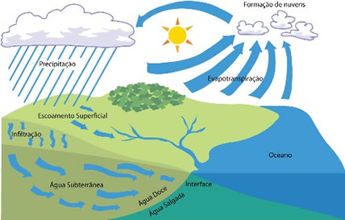
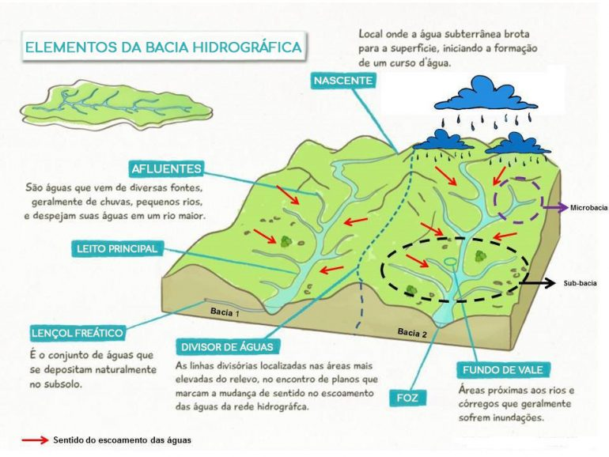
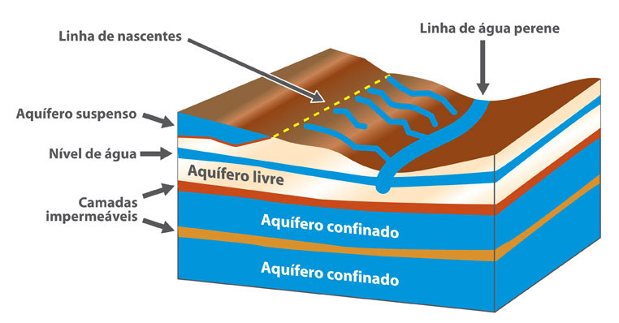
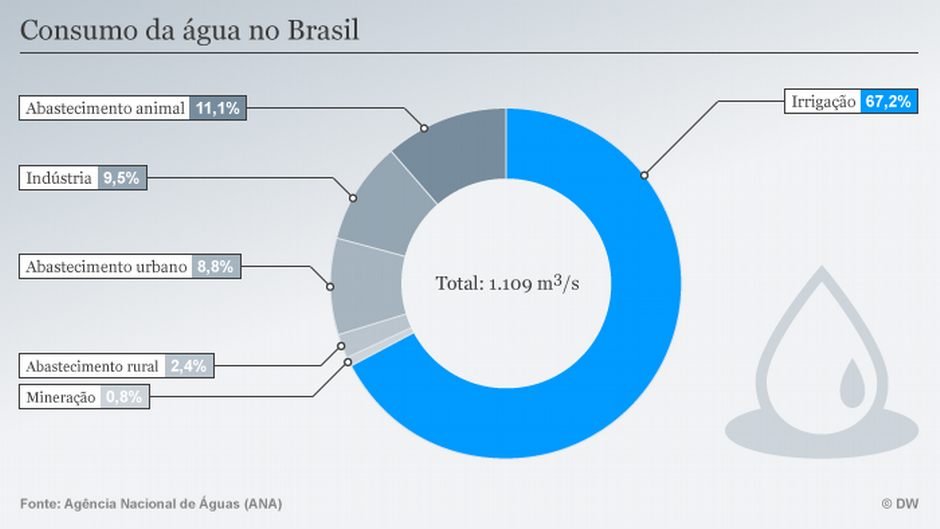
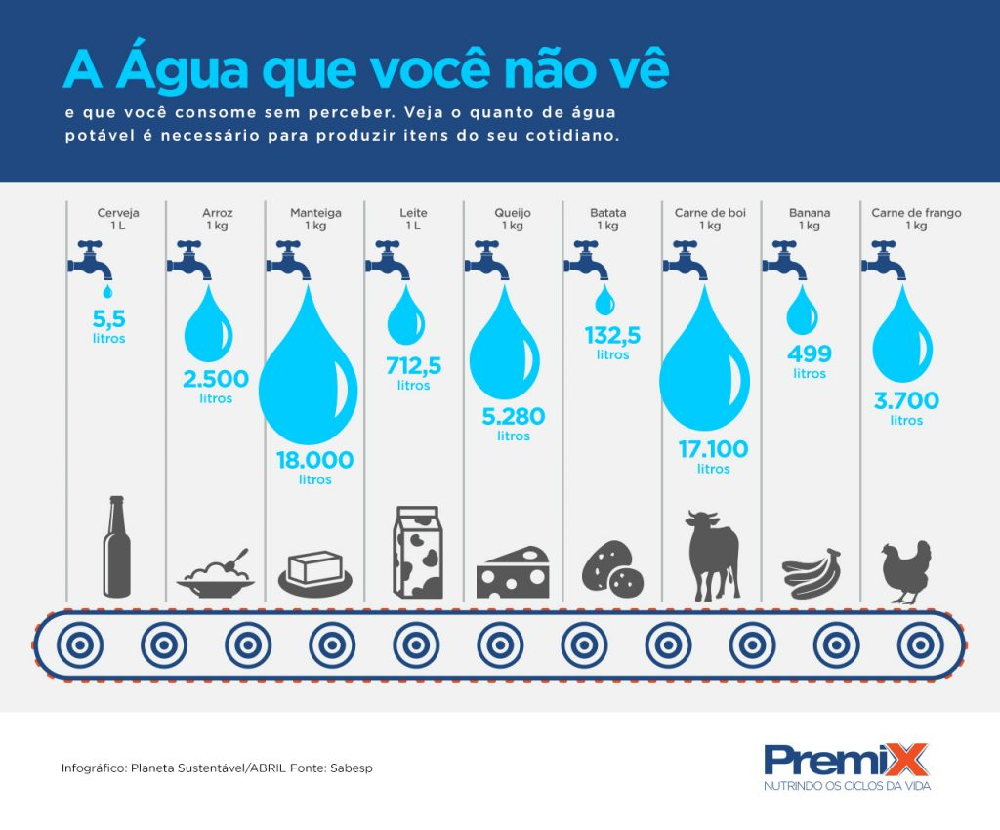
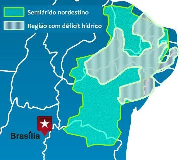

# Hidrografia

## Recursos hídricos

**97,5%** de toda água na Terra (1,386 trilão de km²) é salgada, enquanto os outros **2,5%** é doce

    68,9% - calotas polares; 29,9% - aquíferos; 1% - superfícies acessiveis. A água doce aproveitável representa 0,007%

Brasil possui maior parcela (12%) das fontes renováveis (energia) de **água doce** do mundo (UNESCO)

    9 países possuem 60%

---

## Cliclo hidrológico

::: notes

- Sistema fechado de escala global entre a superfície e a atmosfera, ou seja, há apenas intercâmbio de energia, não de matéria
- Fatores que influenciam na variabilidade do ciclo: 
  - quantidade de vapor d'água, CO2 e ozônio na atmosfera; distribuição da energia solar entre os locais do planeta; comportamento térmico dos continentes em relação aos oceanos; variabilidade de solos/cobertura vegetal (uso e ocupação do solo)

- [O Ciclo da Água (Ciclo Hidrológico)](https://www.youtube.com/watch?v=vW5-xrV3Bq4)

:::

---

## Águas oceânicas

<object data="assets/mundo_clima_e_correntes_maritimas.pdf" type="application/pdf"></object>

::: notes

- <u>Oceanos</u>: enormes massas de água salgada que circundam continentes
  - Possuem relevo próprio e menor salinidade e temperatura
- <u>Mares</u>: massas de água salgadas próximo ou no interior dos continentes, sobre a plataforma continental
  - Possuem maior salinidade, temperatura, transparência e menor profundidade.

- Os **mares** são classificados em: 
  - Mar <u>aberto</u> ou costeiro: ligação com oceanos por largas passagens  - Mar do Japão; 
  - Mar <u>interior</u> ou continental: ligação com oceano por canais ou estreitos - Mar Mediterrâneo; 
  - Mar <u>fechado</u> ou isolado: sem ligação com oceano - Mar Morto;

- <u>Correntes marítimas</u> são movimentos horizontais das águas oceânicas, ocasionados pela diferença de salinidade e temperatura das águas e movimento de rotação da Terra. Podem ser quentes ou frias, influenciando o clima do planeta e a piscosidade (ocorrência de peixes) das áeas oceânicas

:::

---

## Águas continentais

### Bacias hidrográficas

Área de captação natural da água que chove e escoa para um único ponto de saída. 

::: notes

- É um sistema aberto - entrada e saída de energia e matéria. Compostas por sistemas físicos, econômicos e sociais

:::

---

### Bacias hidrográficas brasileiras

<object data="assets/brasil_bacias.pdf" type="application/pdf" class="stretch"></object>

::: notes

- Ricos em rios, pobre em lagos
- Predominam rios **perenes** (nunca secam) e com drenagem exorreica (nascente no continente, foz no oceano). 
  - Maioria são rios de **planaltos** (alto potencial hidráulico) e de **regime pluvial** (cheias no verão); 
  - Grandes divisores de água: Cordilheira dos Andes, Planaltos das Guianas e Planalto Brasileiro

- <u>Bacia amazônica</u>: **maior do planeta** (3 904 393 km2); drena terras de 45% do território; Rio Amazonas é o mais extenso (7 100 km) e de maior volume; Amazonas é um rio de planice com afluentes em planaltos; maior potencial hidrelétrico (menos aproveitado); sempre serviram como **canais de entrada** para a região e principal **meio de comunicação**
- <u>Bacia Platina</u>: constitui **três bacias secundárias**: bacia do Paraná, Uruguai e do Paraguai; os três rios formam o Rio da Prata quando se encontram em território argentino.
- <u>Bacia do Paraná</u>: maior aproveitamento hidrelétrico do país; localizam-se várias hidrelétricas (maior é a de Itaipu - 20% da produção de energia elétrica); banha regiões industriais do Sul e Sudeste; trechos importantes para navegação (hidrovia do Tietê)
- <u>Bacia do Paraguai</u>: atravessa o pantanal e é amplamente **navegável**; pequeno potencial hidrelétrico; projeto para construção de hidrovia está parado por falta análise dos impactos socioambientais
- <u>Bacia do Uruguai</u>: curso superios é planáltico; poucos trechos navegáveis; baixo aproveitamento hidrelétrico, apesar do grande potencial
- <u>Bacia do Tocantins ou Tocantins-Araguaia</u>: **drena 9,5% do território nacional**; rio Tocantins é o principal, desagua no Golfão Amazônico; longos trechos navegáveis; nos anos 70 <u>foi construída usina hidrelétrica de Tucuruí (segunda maior do país) para atender consumo do Projeto Carajas (Pará)</u>; regime tropical (cheias no verão e vazantes no inverno); projeto para construção da hidrovia Tocantins-Araguaia (problemas ambientais e de navegação)
- <u>Bacia do Nordeste</u>*: Compreende vários estados nordestinos e alguns da região norte; muitos rios são temporários em virtude do clima da região
- <u>Bacia do Sudeste</u>*: Formada pelos rios Ribeira do Iguapé (SP), Itajaí (SC), Taquari, Jacuí e Camaquã (RS); baixo potencial hidrelétrico
- <u>Bacia do Leste</u>*: Composta pelos rios: Paraíba do Sul (SP e RJ), rio Doce (MG e ES) e Paraguaçu (BA); O Paraíba do Sul tem **crescente aumento da poluição**, devido o surgimento da primera megalópole entre São Paulo e Rio de Janeiro; Bacias do Leste e Sudeste sofreram em 2014/15 grave seca
- <u>Bacia do São Francisco</u>: Drena **7,5% do território nacional**; Rio SF (integração nacional) é navegável entre MG e BA; <u>atravessa áreas de clima semiárido</u> (Polígonos das Secas), sendo fundametal pelas populações locais; através da agricultura irrigada, ocorre a produção de frutas como melão e uva; possui alto potencial hidrelétrico com várias usinas: Três Marias, Sobradinho e Paulo Afonso

- As tres últimas são as Bacias Secundárias ou Costeiras, agrupadas pela localização ao longo do litoral. O rio principal de cada uma tem sua vertente, delimitando uma bacia única.

:::

---

### Rios

Corrente de água permanete ou não, que leva excesso das águas continentais superficiais até os oceanos, mares e lagos.

<video src="assets/hidro-meandros.mp4" autoplay loop="true"></video>

::: notes

- Formas: **estuário**, **delta** ou **mista** (rio Amazonas)
- Regimes - variação da quantidade de água que cada rio lança em um ponto do curso durante um ano
  - <u>Regime Pluvial</u>: varia com a quantidade de chuvas; regiões equatoriais e tropicais
  - <u>Regime Nival</u>: águas provẽm do derretimento de geleiras e da neve; áreas de clima temperado com estação fria prolongada
  - <u>Regime Pluvionival</u>: rios alimentados por chuvas e derretimento de geleiras e neve

- Águas fluviais, relevo e clima estão relacionados. 
- Conforme o escoamento das águas, os rios podem ser:
  - **Perenes** (nunca secam); **Intermitentes** ou temporários (possuem água durante período chovoso e secam na estiagem - áreas desertas); **efêmeros** (existem durante ou logo após precipitação)

- [O passado remoto de um grande rio | Youtube](https://www.youtube.com/watch?v=-gqnGGo3vDQ)
- [Chuvas intensas redesenharam o rio Tietê há 17 mil anos](https://revistapesquisa.fapesp.br/chuvas-intensas-redesenharam-o-rio-tiete-ha-17-mil-anos/)

:::

---

### Lagos

Massas líquidas continentais delimitadas por terrenos ou água acumulada em depressões

### Geleiras (ou glaciais)

Regiões onde a precipitação de neve é superior ao derretimento

::: notes

- Tipos de lagos:
  1. <u>Tectônicos</u>: provenientes do deslocamento da crosta terrestre; estreitos e profundos
  2. <u>Vulcânicos</u>: antigas crateras vulcânicas
  3. <u>De Erosão</u>: resultantes da destruição dos rios e geleiras
  4. <u>De Barragem</u>: originam-se da sedimentação ocasionadas por geleiras, rios e mares (lagos do RS)
  5. <u>De Barragem Glacial</u>: formados pela obstrução da moraina (transporte de geleiras)
  6. <u>De Barragem Fluvial</u>: formados pela evolução de meandros (curvas sinuosas dos rios)

- Geleiras
  - Restringem-se as áreas polares (islândsis) e altas montanhas (circos glaciários - depressões, formando vales de rios congelados) 

:::

---

### Água subterrânea

Água que ocupa "vazios" em formações rochosas

{.stretch}

::: notes

- Solos porosos (arenosos) - facilitam a infiltração da água; 
- Solos pouco permeáveis (argilosos rochas) - dificultam a infiltração da água

- <u>Aquíferos</u>: toda formação geológica capaz de armazenas água em seus espaços vazios

- Tipos de aquíferos:
  - <u>freático</u> ou livre: mais pŕoximo da superfícia e pode ser facilmente aproveitado
  - <u>confinados</u>: água armazenada em profundidade e "presa" entre rochas impermeávels. Para aproveitamento, são utilizados poços artesianos com bombas e compressores

:::

---

### Aquíferos do Brasil

<object data="assets/brasil_aguas_subterraneas.pdf" type="application/pdf" class="stretch"></object>

::: notes

- Devido a grande extensão e capacidade ambiental, há uma enorme concentração de reservatórios no Brasil. 
- Principais aquíferos: Guarani, Alter do Chão (maiores do mundo), Cabeças, Baurú, Urucuia-Areado e Furnas

**Aquífero Guaraní**

- Principal reserva subterrânea de água doce da América do Sul e **maior aquífero do mundo**
- O líquido escorre devagar pelos poros do Arenito e leva décadas para caminhas centenas de metros. Enquanto desce, é filtrado, chegando limpo;
- Nas margens, a erosão expõe pedaços do arenito (afloramentos), por onde a chuva entra (áreas de recarga) - e a contaminação pode ocorrer;

- Sob a superfície de São Paulo, além do Guarani, há o reservatório do **Aquífero Bauru**, que é mais jovem, menor, mas abastece fazendas e pequenas cidades;
- A cada 100m, temperatura do solo sobre 3 ºC, chegando a 50 ºC no fundo
- Dividido em 4 grandes compartimentos (Oeste - boas condições; Norte-Alto Uruguai - inacessível por rochas vulcânicas). Altos teores de fluoretos e sódio podem causar alcalinização do solo

:::

---

## Poluição

- <u>Contaminação</u> ou colmatação; Acidificação; Alterações hidrológicas
- <u>Assoreamento</u>: acúmulo de sedimentos, lixo e outros materiais no leito dos cursos d'água, levados pela **chuva**, **vento** ou pelo **ser humano**

<video src="assets/hidro-mangue_costa.mp4" autoplay loop="true"></video>

[Como os manguezais protegem as áreas costeiras! | Instagram](https://www.instagram.com/p/CTe7hXADsgC/)

::: notes

- Assoreamento:
  - Desmatamento (mata ciliar) -> perda do solo (erosão) -> assoreamento -> desequilíbrio hidrológico -> cheias (menor capacidade de escoamento); estiagens (seca - menor quantidade de água e umidade dos solos)

  - Retirada da **mata ciliar** faz com que o solo e as rochas nas margens sejam carregados para os **fundos dos rios**, que pode ser intensificado com chuva. Deposição de lixo, resíduos de construção civil, esgoto aumenta a carga de detritos
  - Reduz do volume d'água, torna-a turva (impedindo renovação do oxigênio) podendo extinguir a vida presente;
  - Ajuda a causar enchentes pois o leito do rio fica ocupado pelos detritos, então nas chuvas intensas, a água transborda. Traz conseqências de **abastecimento nas cidades**, **fornecimento para agricultura**, **dificulta navegação**

- <u>Eutrofização</u>: consequência do aumento da quantidade de nutrientes no ambiente aquático
  - **aumento de nutrientes** (fósforo e nitrogênio - detergentes, esgotos, adubos - acumulados naturalmente) -> proliferação de algas e cianobactérias (agua turva) -> morte das plantas (impede a fotossíntese) -> uso elevado de oxigênio gasto na decomposição -> diminuição do oxigênio dissolvido na água -> morte da fauna aquática

- Soluções:
  - Gestão ambiental das bacias hidrográficas: uso como unidade de planejamento
  - Inclusão da sociedade no planejamento ambiental: comitês de gerenciamento (Sinos e Gravataí - RS)
- Discussões: 
  - fontes de receita - cobrança aos usuários pelo uso e princípio poluidor-pagador
  - atribuição de preços tem como finalidade induzir alocação eficiente da água

:::

---

## Crise mundial da água

- Causas gerais: seca, poluição e má distribuição
- Consequências: falta traz impactos sociais, econômicos e ambientais

::: notes

- Causas no Brasil: aumento no consumo (crescimento populacionao); desperdício (irrigação na agricultura); diminuição do nível das chuvas (desmatamento na floresta amazônica está relacionado, pois os "rios voadores" levam a umidade à outras regiões)
- Consequências no Brasil: redução da ofertade alimentos, comprometimento da gereção de energia

- Seca no Sudeste brasileiro em 2014/15
  - Sistema da cantareita (atende mais 9 milhões de pessoas) sofreu com problema de abastecimento causado pela falta de chuvas acompanhado do aumento da temperatura. A causa da seca esteve relacionada com a formação de um bolsão de ar quente e seco que impediu a chegada de nuvens carregadas de umidade vindas da Amazônia 

REFERÊNCIA:

- [Uma possível origem das estiagens de verão do Sudeste](https://revistapesquisa.fapesp.br/uma-possivel-origem-das-estiagens-de-verao-do-sudeste/)

PARA IR ALÉM:

- [Falta de água | Nerdologia](https://www.youtube.com/watch?v=RsUD8CTDdAw)
- [ONU: mundo enfrenta uma crise de água e precisa reagir](https://www.youtube.com/watch?v=1RLhXg_7bKw)
- [Desmatamento, clima e insegurança hídrica — parte 1: Rios voadores](https://www.youtube.com/watch?v=lyp83uYdtbk&t=102s)

:::

---

### Uso e distribuição da água no Brasil

- O maior consumidor dos recursos hídricos é a agricultura; responsáveis por 70% do consumo de água doce; A indústria é a segunda na linha de consumo, usando 22% das  reservas hídricas e nós, apenas 8%. 

{.stretch}

---

{.stretch}

---

### Exploração dos aquíferos

- É uma alternativa para locais que sofrem com a **falta de água**. Porém, o uso de águas subterrâneas deve ser feito com cuidado, pois pode prejudicar as gerações futuras. 
- Além disso, um aquífero pode ser facilmente contaminado por substâncias tóxicas decorrentes de atividades agrícolas, lixões e vazamentos de esgoto, por exemplo. 

::: notes

- Pesquisa da Embrapa apontou **níveis de agrotóxico próximos ao limite de risco para saúde humana** na região de Ribeirão Preto (SP) e apontou outras 4 áreas de alto risco de contaminação por agrotóxicos (nascente do Araguaia, limite setentrional do aquifero, região de Lajes - SC, Alegrete - RS e interior do PR), onde não é protegido pela rocha basáltica

- [Estudo mostra que o Aquífero Guarani está contaminado por agrotóxicos](https://www.ecodebate.com.br/2011/05/19/estudo-mostra-que-o-aquifero-guarani-esta-contaminado-por-agrotoxicos/)
- [Relatório Conjuntura dos Recursos Hídricos 2019](http://conjuntura.ana.gov.br/)

:::

---

## Transposição das águas do Rio São Francisco

- Desde o tempo do império, discuti-se a possibilidade da transposição das águas do Rio São Francisco para o **Polígono da Seca**, para solucionar o problema da seca no Nordeste.

{.stretch}

::: notes

- A transposição consiste em estender a circulação do rio Velho Chico (leito percorre MG, PE e BA) para RN, PB, PE, CE (1/3 do semiárido nordestinho), abastecendo <u>8 milhões de pessoas</u>, <u>268 cidades</u> e irrigar <u>300 mil hectares de terras</u>. Junto com Itaipu e a Transamazônica, a transposição seria uma das maiores obras de engenharia do país

- Defesa
  - **Redução da desigualdade** no acesso aos recusros hídricos para os habitantes em regiões do semiárido
- Críticas
  - Ambientalistas e técnicos argumentam que o Velho Chico não suportaria ceder parte do volume de suas águas, que há muito tempo é castigado pelo **uso indiscriminado** de suas águas e pelo crescente desmatamento de suas matas ciliares, gerando **assoreamento**

- Outros pontos: Garantia de vazão do rio que assegure a **geração de energia elétrica** e **irrigação**.
    - Os afluentes do Rio São Francisco possuem **regime temporário**. Isso causa **diminuição gradativa de sua vazão** ao longo do ano (pelas interrupções/diminuições da vazão dos afluentes), **agravada pelo uso das águas na irrigação** (não retornam ao rio). Parte do volume de água desviada seria destinada a projetos de agriculura irrigada (p/ produção de frutas para exportação; produção de camarão em açudes). Outra parcela seria para abastecer centros urbanos.

- Alternativas à transposição: Melhor **gerenciamento** e **uso sustentável** dos recursos hídricos do semiárido; investimento em **obras não acabadas**; **revitalização do rio** - reflorestamento das margens (não possui 95% da vegetação nativa), evitando erosão/assoreamento (causam problemas para navegação e de equilíbio ambiental)

:::