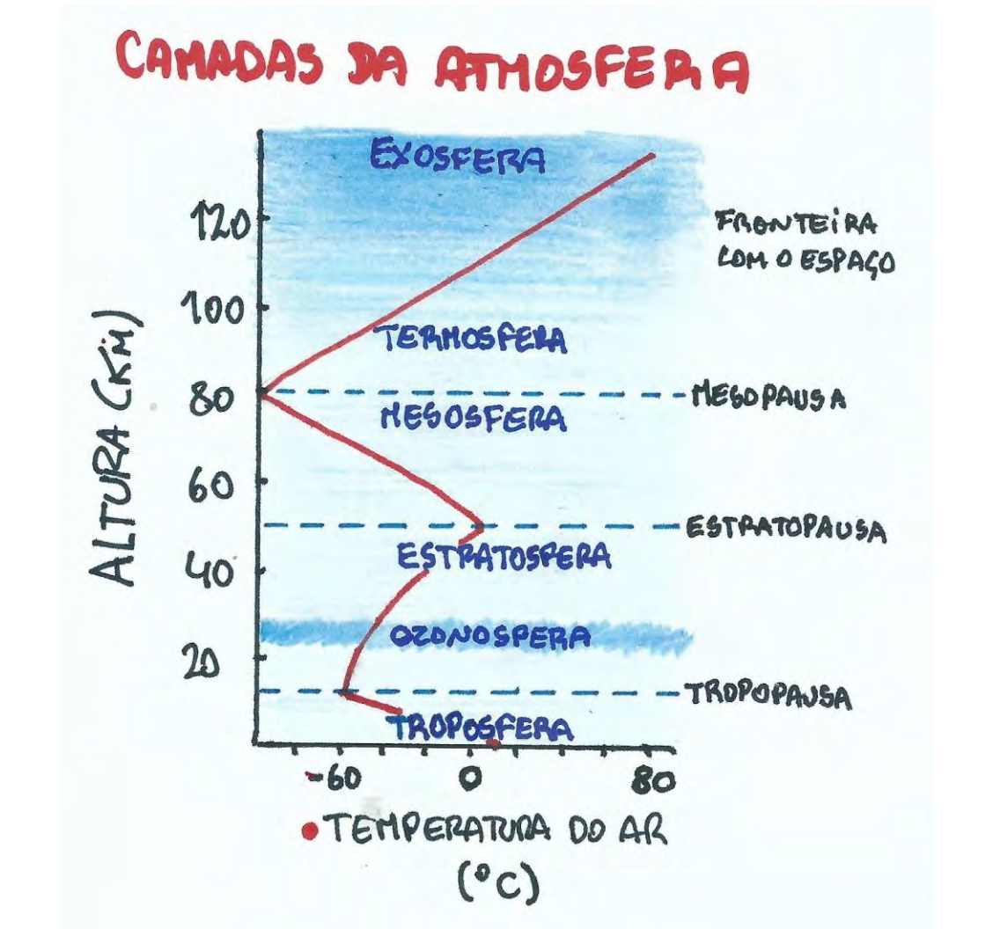
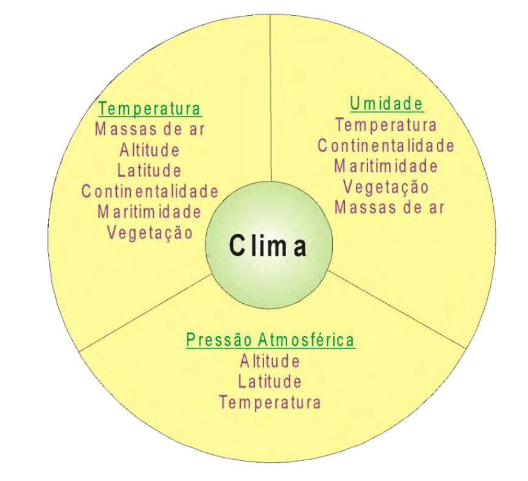
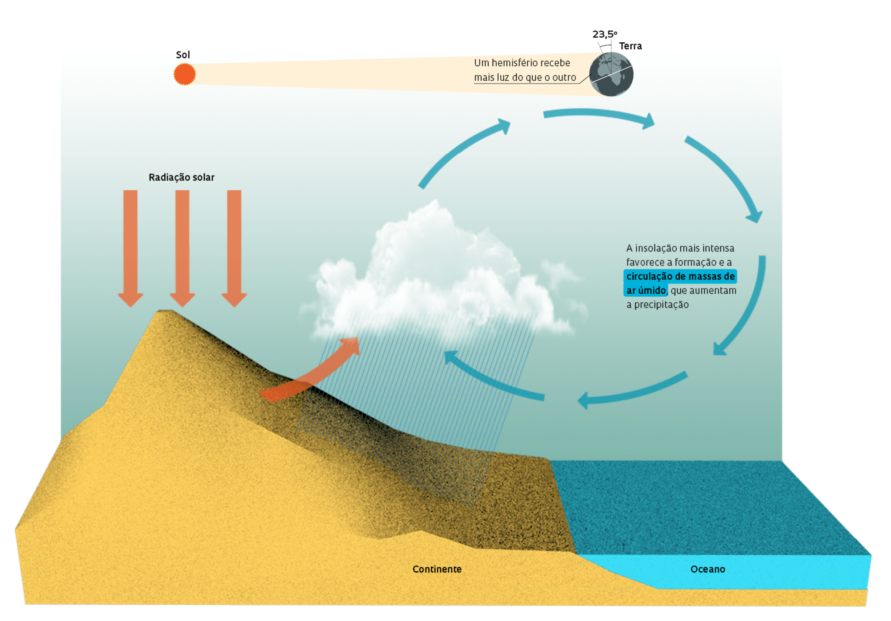
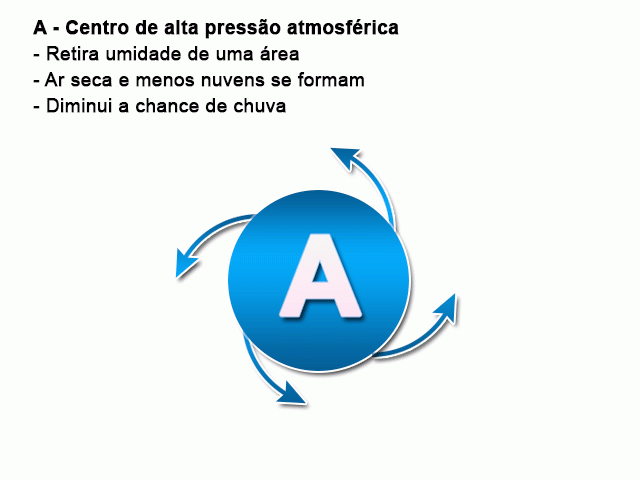
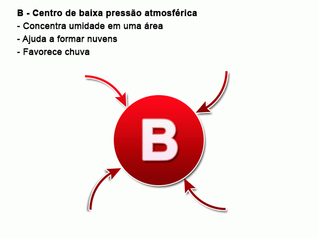
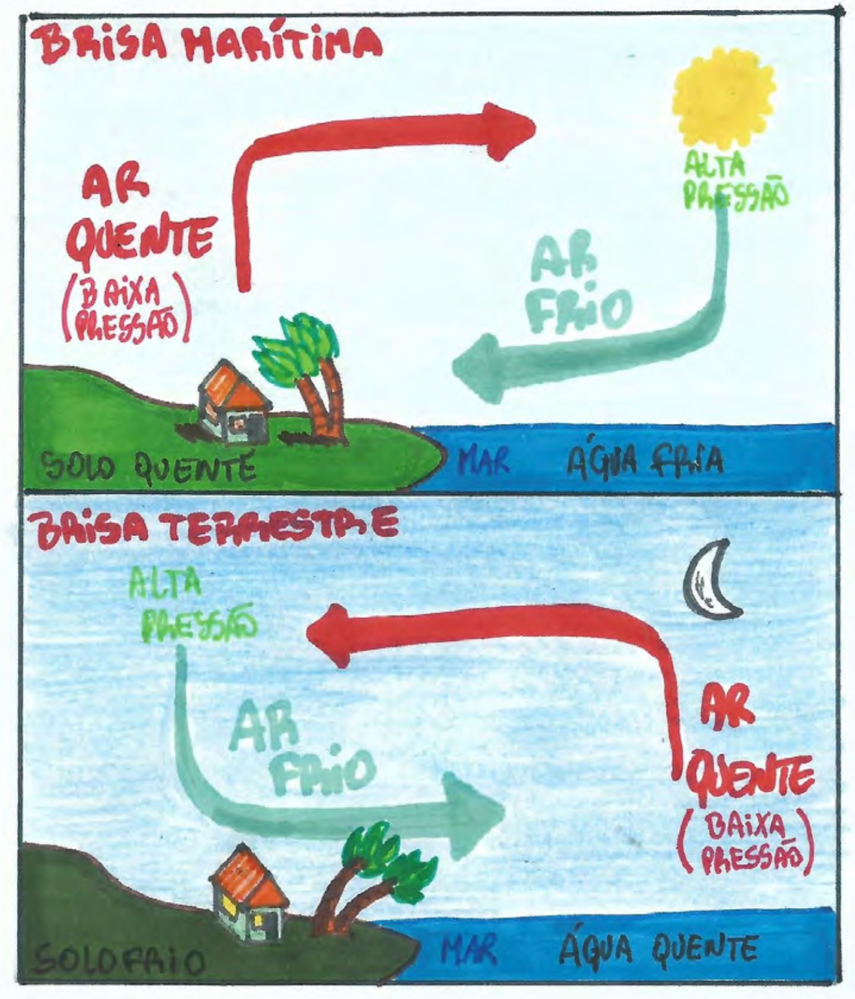
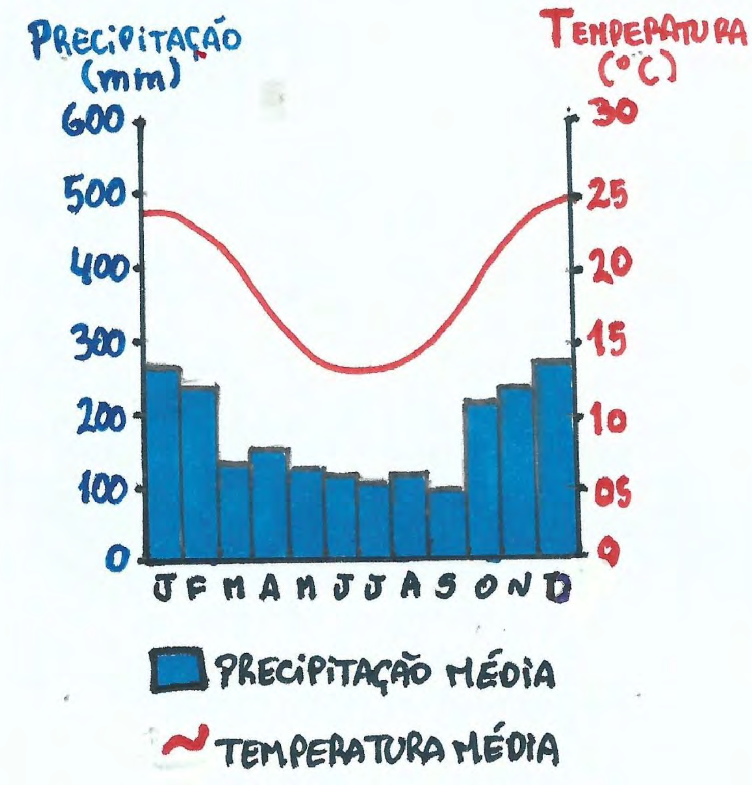

# Climatologia

## A Atmosfera

| **Camada gasosa** que envolve o planeta, composta de N2 (78%), O2 (21%) e outros gases (1%)

{.stretch}

::: notes

É dividida em diferetens regiões, de acordo com o comportamento da temperatura

- <u>Troposfera</u>: camada mais baixa onde a temperatura diminui com a altitude. 75% do volume dos gases e 80% da umidade estão aqui. É onde ocorrem os movimentos verticais do ar e fenômenos climatológicos
- <u>Estratosfera</u>: a temperatura aumenta com a altitude. O ar é limpo e claro (sem vapor d'água). Presença da camada de ozônio
- <u>Mesosfera</u>: temperatura volta a cair com a altitude, chegando a -95ºC
- <u>Termosfera</u>: temperatura aumenta com altitude, chegando a 1000 ºC a 350km de altura, devido às partículas ionizadas pela radiação solar. Ar de baixa densidade

PARA IR ALÉM:

- [O que é a atmosfera? | NASA](https://climatekids.nasa.gov/whats-in-the-atmosphere/)

:::

---

### Clima X Tempo | Exercício mental

(por motivos de pandemia!)

- “Se de repente você chegasse a algum lugar - quais pistas lhe diriam como o clima seria?”

::: notes

PISTAS

1. <u>Latitude</u>: incidêndia do sol ao meio dia indica quão próximo da linha do equador estamos
2. <u>Variedade de vegetação</u>: onde há variedade, o clima varia menos; onde não há, o clima é mais variado (mais extremo)
3. <u>Tipos de vegetação</u>: aparência dos principais tipos. Por exemplo: palmeiras indicam **climas** **quentes** ou tropicais; plantas carnudas são comuns em **áreas** **secas**; 
4. <u>Edifícios</u>: telhados planos, paineis soláres e ar condicionado sugerem **clima quente** (ao menos no verão); calhas de chuva profunda mostram **chuvas fortes**; telhados íngrimes pode ser para que a **neve** escorregue durante **clima frio do inverno**
5. <u>Áreas de parques e estradas</u>: aspersores de água (p/ irrigação) pode indicar **áreas com estação seca**
6. <u>Roupas</u>: roupas variadas pode indicar **clima mutável**;

PRINCÍPIOS:

- Clima dependa da latitude - bem como das cadeias de montanhas, conexões continentais e correntes oceânicas. 
  - Zonas climáticas mostram diferentes faixas de temperatura e quantidade de chuvas ao longo do ano

- A vegetação segue as condições climáticas.
  - Plantas desenvolveram características únicas ligadas à precipitação e temperatura, assim como nós humanos com nossas roupas e construções.

:::

---

### Clima

{.stretch}

::: notes

- Clima refere-se às **características da atmosfera** através de observações durante um **longo período** 
  - Medido pela análise estatística do **tempo** em um dado lugar

- As características de um clima são definidas a partir da observação de seus elementos formadores e fatores modificadores
  - <u>Elementos climáticos</u>: os que compõe o clima; 
  - <u>Fatores climáticos</u>: aqueles que afetam os elementos climáticos

PARA IR ALÉM:

- Vídeo (3:47): [Interrelação Clima e Relevo](https://www.youtube.com/watch?v=hJ54uEwJLK0&list=UUAgrj2RiWWwJx4vwNCrQC2A&index=7) 

:::

---

### Temperatura

{.stretch}

::: notes

- É o **estado térmico da atmosfera**. A atmosfera é aquecida pelas radiações de calor emitidas pela Terra e principalmente pelo Sol
- Não é a mesma para todos os lugares da Terra. 
  - Está sujeita a variações provocadas por diversos fatores: <u>latitude</u>, <u>altitude</u>, <u>continentalidade</u>, <u>maritimidade</u>, <u>vegetação</u>, <u>massass de ar</u> e <u>estações do ano</u>. Temperatura média do planeta ~= 17ºC
- Raios solares não atingem a superfície terrestre de maneira uniforme, por causa do formato esférico da Terra.
  - Na região tropical, atingem o planeta de forma perpendicular (90º); nas zonas frias, em ângulos tangenciais. Essas diferenças são importantes para a circulação geral da atmosfera e geram o gradiente de temperatura do planeta

CONCEITOS

1. <u>Amplitude térmica</u>: diferença entre as temperaturas máximas e mínimas (diárias, mensais ou anuais)
2. <u>Isotermas</u>: linhas que unem pontos que apresentam mesma temperatura
3. <u>Isóbaras</u>: linhas que unem pontos de igual pressão atmosférica
4. <u>Média térmica</u>: média aritmética das temperaturas de um determinado dia, mês, ano
5. <u>Equador térmico</u>: linha dos pontos de máxima temperatura. IMPORTANTE: não coincide com o Equador geográfico, pois dependendo da época do ano, o Sol aquece mais um hemisfério do que o outro
6. <u>Latitude</u>: quanto maior a latitude (mais pŕoximo das regiões polares), menor a temperatura média; quanto menor a latitude (mais próximo das regiões intertropicais).
7. <u>Altitude</u>: O ar concentra-se na superfície, principalmente devido a força gravitacional, o que ocasiona maior pressão. Em altitudes elevadas, o ar torna-se mais <u>rarefeito</u> - com menor concentração de gases e umidade - reduzindo a retenção de calor e portanto, **diminuindo a temperatura**.
   - Quanto maior, a altitude, menor a temperatura (-1ºC para cara 180m, em média).
8. <u>Pressão atmosférica</u>: Força que o ar exerce sobre superfície terrestre, relacionada com a força da gravidade. Pode modificar-se com a temperatura e altitude.

:::

---

## Continentalidade e maritimidade

- Fatores climáticos (interferem no clima) que ocorrem pelo **movimento das massas de água** dos mares e oceanos
  - O efeito de <u>maritmidade</u> faz com que a amplitude térmica seja menor em locais mais **próximos do mar**. 
  - Já o de <u>continentalidade</u>, faz com que a amplitude térmica seja maior em locais mais no **interior do continente**

::: notes

- Grandes massas de água retem o calor dos raios solares por mais tempo do que o solo, assim como resfriam mais lentamente. Isso mantém a constância da temperatura, uma vez que de dia (mais quente), a água absorve o calor do sol enquanto a noite (mais frio) a água faz com que o ar em torno se aqueça (por <u>irradiação</u>)

:::

---

## Correntes marítimas

<object data="assets/mundo_clima_e_correntes_maritimas.pdf" type="application/pdf" class="stretch"></object>

::: notes

- São extensas **porções de água** que se deslocam pelo oceano, quase sempre nas mesmas direções.
  - Ocorrem quase sempre nas mesmas direções, como se fossem "rios" dentro do mar, movimentadas pela **ação dos ventos** e pela **rotação da Terra**.
- Diferenciam-se das águas próximas aos continentes em <u>temperatura</u>, <u>salinidade</u> e <u>direção</u>. 
  - Nas proximidades dos círculos polares, originam-se correntes marítimas frias, que se deslocam na direção da Zona Intertropical. Aos se misturarem com águas dos mares quentes, elas se aquecem e retornam para as altas latitudes, reiniciando o ciclo.
- Carregam consigo porções de ar com temperaturas de suas áreas de origem. 
  - Desse modo, influencia nas médias <u>térmicas</u> e <u>pluviométricas</u> das fachadas litorâneas e em certos casos também nos interiores dos continentes.
- Alguams correntes:
  1. <u>Humboldt</u> (hemisfério Sul) e da <u>Califórnia</u> (hemisfério Norte), ambas frias, causam queda na temperatura nas áreas litorâneas do norte do Chile e sudoeste dos EUA, respectivamente. 
     - Suas baixas temperaturas retiram o calor do ar sobre os oceanos, reduzindo evaporação e condicionando a formação de litorais secos, fatores que originam desertos como é o caso do Atacama (Chile) e o da Califórnia (EUA)*
  2. Correntes quentes como a do <u>Brasil</u> (leste da América do Sul), a de <u>Madagascar</u> (sudeste da África) e da Austrália estão associadas a massas de ar quente e úmido, provocando fortes chuvas no litoral.
  3. A corrente do Golfo, quente, impede o congelamento do Mar do Norte e ameniza o inverno rigoroso na Europa ocidental.

:::

---

## Circulação geral da atmosfera

- A superfície terrestre recebe diferentes quantidades de calor. As áreas mais aquecidas apresentam <u>centros de baixa pressão</u> e as àreas menos aquecidas formam <u>centros de alta pressão</u>

:::::: {.columns}

::: {.column}

{.stretch "width=300"}

:::

::: {.column}

{.stretch "width=300"}

:::

::::::

---

:::::: {.columns}

:::{.column}

### Ventos

- Ventos são deslocamento de ar de áres de alta pressão (dispersoras de vento) para locais de baixa pressão (receptoras de vento)

### Massas de ar

- Massas de ar são grandes porções da atmosfera que se desloca apresentando as mesmas características de <u>temperatura</u>, <u>pressão</u> e <u>umidade</u> adquiridas em suas áreas de origem

::: 

:::{.column}

{.stretch "height=400"}

:::

::::::

::: notes

- O ar fica mais comprimido com baixas temperaturas, pesando mais; já em locais com temperaturas mais altas, as partículas de ar ficam mais dilatadas, pesando menos

VENTOS:

1. <u>Ventos regulares ou constantes</u>: sopram de zonas de alta pressões para baixas no globo. 
   - Sofrem desvio para Oeste, pela força de Coriolis - interferência do movimento de rotação da Terra (O -> L), ventos sofrem desvio p/ direita no HN e esqueda no HS; 
   - São os ventos <u>alísios</u> e <u>contra-alísios</u> (de altitude que sopram nas mesmas latitudes dos alísios, mas em sentido oposto)
2. <u>Ventos periódicos</u>: se repetem em regiões específicas do globo.
   - <u>Monções</u>: sul e sudeste da Ásia; Ciclones extratropicais: centros de alta pressão (lat 35º - 60º N/S); Ciclones tropicais / furacões / tufões: centros de baixa pressão (5º - 20ºN/S); 
   - <u>Brisas</u>: ventos diários que mudam a direção do dia para a noite (decorrência da maritimidade)
3. <u>Ventos locais</u>: locais restritos do globo.
   - Minuano (RS - Brasil); Pampeiro (Argentina); Mistral (França); Simum (Saara); Föehn (Alpes Suíços); Siroco (Grécia e Itália)

MASSAS DE AR:

- Também se deslocam das altas para as baixas pressões
- Os tipos são <u>Equatoriais</u>, <u>Tropicais</u> e <u>Polares</u>, cada uma com os subtipos <u>Marítimas</u> e <u>Continentais</u>.
- O encontro entre duas massas de ar de qualidades diferentes são chamadas **frentes**
  - São a zona de contato entre uma massa fria e outra quente. Marcada por instabilidade atmosférica, provocando fortes chuvas
- Em latitudes médias (30º - 40º S e N), o tempo meteoroloógico é caracterizado pelo movimento frequente de massas de ar

:::

---

### Umidade

- É a presença de **vapor d'água na atmosfera**, proveniente da <u>evaporação</u> e <u>evapotranspiração</u>. Varia de um lugar para outro de acordo com a radiação solar recebida
- <u>Precipitações</u>: formas que o vapor de água, após se condensar, chega à superfície. Para que ocorra, atmosfera deve ficar saturada (cheia) de vapor, que deve condensar (gasoso -> líquido) após queda da temperatura.

::: notes

- Quanto maior <u>maritimidade</u> -> maior umidade; E quanto maior <u>continentalidade</u> -> menor umidade
- <u>Altitude</u>: dependendo da temperatura, o ar contem mais ou menos vapor d'água - capacidade higrométrica. Quanto maior a altitude, menor a temperatura e então, menor a umidade também

1. <u>Umidade absoluta</u>: quantidade de vapor contido em um determinado volume de ar (g/m³)
2. <u>Umidade relativa</u>: relação entre umidade absoluta do ar e sua capcidade higrométrica - quando o ar efetivamente possui de vapor, e quanto pode conter
3. <u>Ponto de Orvalho ou de Saturação</u>: ocorre quando a umidade relativa atinge 100%, ocorrendo condensação do vapor

TIPOS DE PRECIPITAÇÃO

1. <u>Neve</u>: cristalização do vapor no interior ou pouco abaixo das nuvens, por conta das baixas temperaturas da atmosfera
2. <u>Granizo</u>: gelo que se forma pelas fortes correntes convectivas que realizam transporte das gotas de água condensadas para as camadas mais elevadas e frias
3. <u>Chuvas</u>: frontais; orográficas; convectiva
   - Distribuição irregular (espacial ou temporalmente), por conta de: diferenças de latitude, temperatura e pressão atmosférica nos diferentes locais; influência das correntes marítimas, do relevo, dos oceanos e dos continentes; atuação das massas de ar, entre outras causas.
4. Outros fenômenos: <u>Nevoeiro</u> ou neblina (condensação de vapor próximo ao solo, no inverno); <u>Orvalho</u> (condensação do vapor sobre o solo, nas madrugadas); <u>Geada</u> (sublimação do vapor d'água junto à superfície, qd a temperatura <= 0ºC)

:::

## Climogramas

:::::: {.columns}

::: {.column}

- Gráficos que representam quantidade de chuva e temperatura de uma localidade ao longo dos meses; Marca características do clima

:::

::: {.column}

{.stretch}

:::

::::::

::: notes

- Distribuição anual de chuva e temperatura caracterizam o tipo climático. Alguns aspectos para análise:
  - <u>Chuvas</u>: total de precipitações; distribuição ao longo do ano; meses mais e menos chuvosos; perídos de seca
  - <u>Temperaturas</u>: mês de temperatura mais e menos elevada; amplitude térmica

PARA IR ALÉM:

- [Elementos Que Caracterizam o Clima](http://www.cprm.gov.br/publique/CPRM-Divulga/Elementos-Que-Caracterizam-o-Clima-1267.html)

:::

## Clima no Brasil

<object data="assets/brasil_clima.pdf" type="application/pdf" class="stretch"></object>

::: notes

- Alta variação de aspectos físicos, que influenciam em aspectos culturais e sociais
- Maior porção do território em latitudes baixas ( 0º - 30º )
- Caracterizado pelas condições de **tropicalidade** - climas quentes e úmidos com temperatura média de 20ºC e amplitude térmica < 6ºC
- Avanços e recuos das massas de ar determinam o clima, pois marcam características de tempo (quente, frio, seco). São condicionadas pela altitude do relevo e a posição geográfica do território

:::

# Problemas Climáticos

---

<video width="320" height="240" class="stretch" controls>
  <source src="https://flac-pmd-ngeo.akamaized.net/video/FLAC_FOD_BRA/925/295/1097259587912_4056000.mp4" type="video/mp4">
</video>

---

## Efeito estufa

::: notes

- Causado pela presença de determinados gases na atmosfera terrestre (Gases de Efeito Estufa - GEE). Ocorre naturalmente e responsável por manter a temperatura média do planeta próximo aos 15ºC, caso contrário seria de 17ºC.
  - Consiste no aprisionamento na atmosfera de parte do calor gerado pela interação da luz solar com a atmosfera e a superfície.
  - Sua intensificação está ligada ao aumento da emissão de GEE
- O Dióxido de carbono (CO2) resulta da combustão de matéria que contenha o elemento Carbono - como os combustíveis fósseis.
  - Atividades industriais também utilizam o gás - setor metalúrgico, siderúrgico, de transportes e cimenteiro.
  - Mudanças no uso do solo causadas pelas queimadas, que precedem o desmatamento
- O CH4 é produzido pela decomposição de matéria orgânica. 
  - Atividades humanas que aumentam a emissão: agropecuária, plantios irrigados, mudanças no uso do solo (desmatamentos), produção de lixo e esgoto
- A Revolução industrial é um marco histórico para o aumento da concentração de GEE na atm.
  - Advento do tear a vapor aumenta consumo de combustíveis fósseis (carvão) ao longo do século XIX
  - IPCC (Painel Intergovernamental sobre Mudanças Climáticas) aponta que desde 1750 teria havido crescimento de 35% na qtd de CO2 na atm
- Contribuição para o efeito estufa intensificado: CO2 (70%), CH4 (22%), N2O (6%), outros (2%)
- Maiores emissores *

::: 

---

## Protocolo de Kyoto

::: notes

- Convenção - Quadro das Nações Unidas sobre Mudança do Clima - na Rio-92, marca reconhecimento para tomadas de ações
  - Foi definido processo permaente de revisão, discussão e troca de informações, possibilitando adoção de compromissos adicionais em resposta a mudanças no conhecimento científico e disposições políticas.
- Dez/1997 é criado o Protocolo de Kyoto, que estabelecia que os países industrializados reduziriam suas emissões combinadas de gases de efeito estufa em pelo menos 5% em relação aos níveis de 1990 até 2008-2012. Acordo entrou em vigor em Fev/2005
- Acordo estipula criação de fundo anual de US$ 500 milhões, abastecido pelos países industrializados, a fim de facilitar adaptação das nações não industrializadas às exigências.
  - Também determina regras para compra e venda de créditos de carbono obtidos por cortes nas emissões de CO2
- EUA, Austrália, China, Índia, Japão e Coréia do Sul reuniram-se em Sydney (Austrália) em Jan/2006, para formar bloco alternativo ao de Kyoto.
  - Estratégia foi de estipular metas voluntárias. Sugeriram uso de novas tecnologias para reduzir liberação dos GEE.
  - Principal proposta era a de substituição de combustíveis fósseis por fontes renováveis de energia (solar, eólica), considerada inviável por conta dos altos custos e baixa produtividade
- Na COP-17 - conferência realizada em Durban (África do Sul) em 2011 - foi criado documento (Plataforma Durban) estipulando os compromissos:
  1. Prorrogação do prazo final do Protocolo de Kyoto até 2020
  2. Conferências agendadas para que em 2015 fosse criado documento substituto ao Protocolo de Kyoto
- Na COP-21, Dez/2015, foi ratificado Acordo de Paris, substituto de Kyoto a partir de 2020.
  - 193 países propuseram metas voluntárias para reduzir impactor do Aquecimento Global
  - Acordo de París estabelece que todos os países deverão se mobilizar para conter aumento da temperatura média do planeta neste século

:::

---

## "Buraco" na camada de ozônio

::: notes

- Camaca de gás Ozônio (10-50 km acima do nível do mar) que envolve a Terra e protege de várias radiações - principalmente a ultravioleta.
  - Desenvolvimento industrial do último século foi responsável pelo uso de produtos que emitem Clorofluocarbono (CFC) - gás que, ao atingir camada, destrói suas moléculas (O3), permitindo aumento da incidência de raios ultravioletas
- Moléculas de CFC passam intactas pela toposfera (0-12 km). Em seguida atingem a estratosfera, onde raios ultravioletas aparecem em maior qtd, quebrando partículas de CFC, liberando o átomo de cloro, que por sua vez rompe a molécula de ozônio (O3), formando monóxido de cloro (CIO) e oxigênio (O2)
- Região mais afetada pela destruição da camada é a Antártida, onde quase metade da concentração de ozônio é "sugada" da atm.
  - Área de 31 milhões de km² fica exposta aos raios ultravioletas (> América do Sul, ou 15% da superfície do planeta). 
  - Cerca de 3-7% do ozônio da ozonosfera já foi destruído pelo homem
- Consequências da redução de O3 na atm:
  1. Aos seres vivos: câncer de pele, catarata, danos ao sistema imunológico
  2. Diminuição da velocidade da fotossíntese dos vegetais
  3. Interferem nos mecanismos de reprodução dos plânctons dos oceanos
- Protocolo de Montreal foi assinado em 1987 por 24 países que se comprometiam a reduzir pela metade a produção de CFCs até 1999.
  - Em 1990, na Conferência de Londres, 70 países concordaram em acelerar eliminação de CFC até 2000 para países desenvolvidos e 2010 para países em desenvolvimento.

:::

---

## Chuva ácida

:: notes

- Toda chuva é ácida em função da presença do CO2 na atmosfera. 
  - Emissões de SO2 e NO2 - provenientes da queima de combustíveis fósseis em termelétricas, setor de transportes e industrias - misturam esses elementos ao vapor d'água da atm, produzindo chuva mais ácida que a natural, com maior poder de corrosão
- Regiões mais atingidas são países desenvolvidos. China, Índia, Coréia do Sul, México, África do Sul, Tailândia, Argentina tb já registraram fenômeno.
  - No Brasil, ocorrência é significativa na região metropolitana de São Paulo e no Rio Grande do Sul - próximo às termelétricas movidas a carvão
- Principais consequências: corrosão de metais, pontes e outras construções; doenças respiratórias e dermatológicas; elevação da acidez de rios e lagos, matando a fauna e flora aquática; elevação da acidez dos solos, comprometendo produtividade dos mesmos; destruição da cobertura vegetal

:::

---

## Ilhas de calor

::: notes

- Fenômeno climático típico de grandes aglomerações urbanas e que colabora com aumento dos indices de poluição nas zonas centrais da mancha urbana
- Áreas centrais de grandes cidades são mais verticalizadas, havendo menor circulação do ar, o que eleva a temperatura deste região em relação às áreas periféricas.
  - Asfalto, falta de áreas verdes e concentração de veículos também contribuem para esse aumento
- Com o aumento das temperaturas, ilha de calor atua como zona de baixa pressão, atraindo ventos que carregam grandes quantidades de poluentes, impedindo dispersão do calor
- Criação de áreas verdes nos centros urbanos é uma maneira de evitar formação das ilhas, pois a vegetação altera índices de reflexão do calor e favorece manutenção da umidade relativa do ar

:::

---

## Inversão térmica

::: notes

- Fenômeno climático natural, que ocorre em diversos locais, principalmente nos meses de inverno, no final da madrugada e início da manhã - pico de perda de calor da superfície por irradiação (temperaturas mais baixas).
  1. Com as temperaturas do ar e do solo mais frias, ocorre inversão das camadas de ar: o frio (mais denso) não consegue subir, e o ar mais quente (menos denso) não chega a descer. 
  2. Ao nascer do sol, o solo e o ar mais pŕoximo vão aquecendo lentamente e o fenômeno gradativamente vai se desfazendo
- No meio urbano, a inversão térmica, por concentrar ar frio nas camadas mais baixas da atm, dificulta a dispersão de poluentes emitidos por várias fontes
  - Cidades como São Paulo e Londres são marcadas pela ocorrência deste fenômeno, e por consequência, agravamento da poluição

:::

---

## El ninõ e la ninã

::: notes

- El niño é caracterizado pelo aquecimento (3 - 7ºC) das águas do Oceano Pacífico, nos litorais do Peru e Equador, ocorrendo em períodos de 2 a 7 anos.

Situação Normal

- No HS, os ventos alísios sopram no sentido L-O, com vm = 15 m/s, aumentando nível das águas do Pacífico perto da Austrália - 50 cm > que na América do Sul. 
- Esses ventos carregam águas da superfície (mais quentes) nessa mesma direção. Assim, na costa do Peru, águas frias da corrente de Humboldt vêm à superfície (ressurgência), tornando a região um das mais ricas áreas de pesca

El ninõ

- Aquecimento das águas do Pacífico ocidental acontece pela mudança no comportamento dos ventos alísios. 
  - Eles diminuem velocidade em 1-2 m/s, podendo inclusive mudar de sentido. 
  - Sem os ventos, nível das águas se eleva em direção da AS, e suas águas superficiais têm temperatura aumentada (por se deslocarem menos), fazendo aumentar a evaporação, o que provoca a formação de nuvens (alterando sistema global de circulação de ar)
- Sistema global de circulação de ar é responsável pelo comportamento das temperaturas e chuvas nos oceanos e continentes
  - Ao altera-lo, o El Ninõ provoca mudanças no clima em todo o mundo - chove mais em alguns lugares e há secas mais prolongadas em outros.
  - Países atingidos: Brasil, Peru, Chile, EUA, Austrália, Índia, Filipinas e Indonésia

La Ninã

- Consiste no resfriamento das águas do Pacífico ocidental, alterando as zonas de alta e baixa pressão, o que provoca mudanças na direção dos ventos e massas de ar.
  - Ocorre com frequência aproximada de 2 - 7 anos com duração de 14 meses; Sabe-se menos sobre ele do que o El Ninõ
- Influencia no aumento de chuvas, tempestades, furacões e invernos recordes na América do Norte; chuvas intensas na Índia e Indonésia, diminuindo temperatura nas proximidades do Japão; chuva e frio na África Meridional; frio e secas no Chile e no Peru.

:::