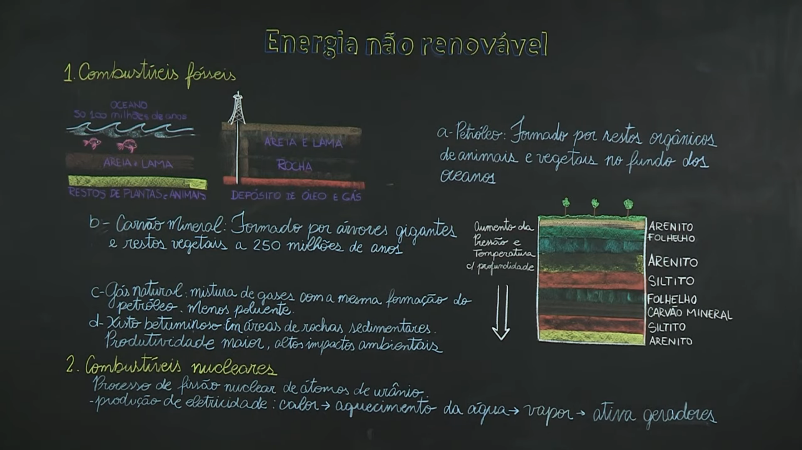
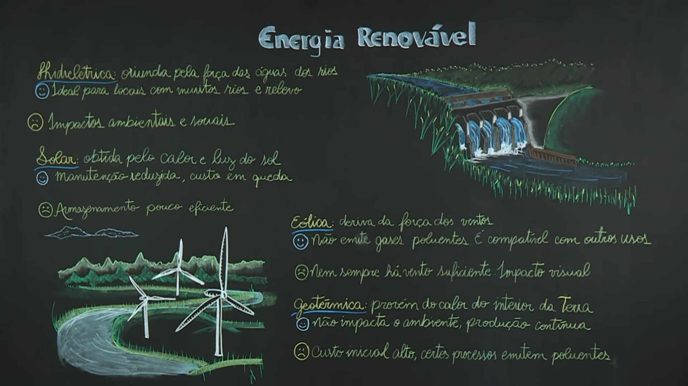
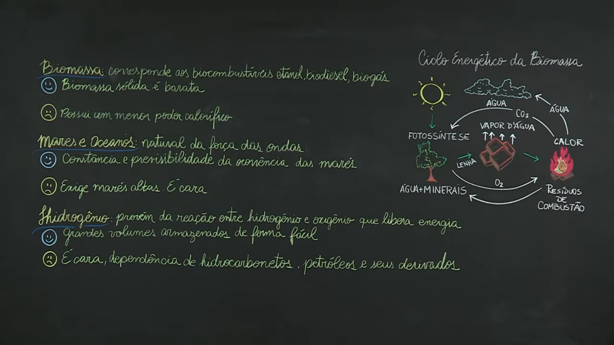
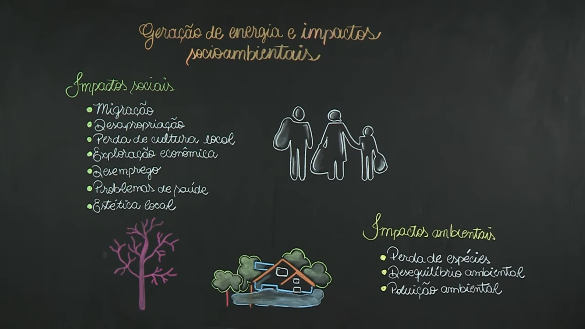
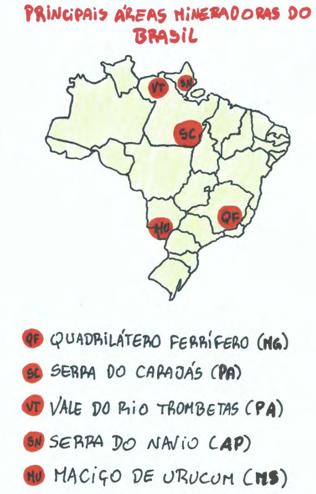

# Energia

## Fontes de Energia

<object data="assets/energia_mundo.pdf" type="application/pdf"></object>

::: notes

- A partir da Revolução Industrial até os dias de hoje, vem ocorrendo uma substituição gradual da energia baseada na força animal e humana por fontes energéticas., que surgiram de modo a atender a demanda da produção industrial e o crescimento das atividades econômicas
- É realizado um calculo periodico de quantos recursos cada país possui de energia, quanto gasta e quais usos - Matriz energética
- Modalidades:
  - Recursos energéticos não-renováveis: não podem ser recuperados espontaneamente ou por ação humana - petróleo, carvão mineral, gás natural, urânio
  - Recursos energéticos renováveis: regenera-mse espontaneamente ou com intervenão humana - vento, ondas, água, energia térmica, sol
- Fontes: Primária (água, petroleo, minerais radiativos, cana-de-açucar); Secundária (eletricidade, gasolina, álcool, diesel, carvão vegetal)
- Participação de cada fonte na eletricidade mundial: Carvão (40%), Gás Natual (19%), Elementos radioativos (15%), Petróleo (10%), Água/outros* (16%). 
  - *(ventos, sol, biomassa, energia marinha e geotérmica)
- Oferta mundial de energia por fonte: Petróleo (31,1%), Carvão (28,9%), Gás Natural (21,4%), Elementos radioativos (4,8%), Água (2,4%), Outros* (11,4%)

**Para ir além**

- [Setor energético - Glossário | Nexo Políticas Públicas](https://pp.nexojornal.com.br/glossario/Setor-energ%C3%A9tico)
    - O que são combustíveis fósseis? Qual a diferença entre carvão mineral e vegetal? O que é eficiência energética? Veja os principais conceitos relacionados ao tema

:::

---

### Energia não renovável

::: notes

**Carvão Mineral**

- Fonte de energia básica do período da Revolução Industrial
  - Países industrializados, através do Colonialismo e Imperialismo, tinham como objetivo a o aumento de produção, ampliação dos mercados e consolidação do capitalismo, levando outros países/regiões à condição de exploradores de matéria-prima.
- O carvão mineral ou carvão de pedra é uma rocha sedimentar de origem orgânica (plantas), resultante de perda de oxigênio e hidrogênio e da concentração de carbono sob uma alta temperarura e pressão. 
  - Processo de formação possuí estágios diferentes, de acordo com o teor calorífico - Turfa (60% de C); Linhito (70%); Hulha (80-85%); Antracito (95%)
- Atualmente é muito utilizado em siderúrgicas, indústria química (náilons, detergentes, tintas), transportes e termelétricas.
  - O uso como fonte de energia é uma das maiores causas de poluição atmosférica - em 2005 sua queima foi 25,3% da energia mundial, petróleo foi 35%
- Mais de 80% das reservas estão situadas no Hemisfério Norte (Europa, América Anglo-saxônica e Ásia oriental)

**Petróleo**

- Origina-se da decompsição, ao longo de milhões de anos, de restos de microorganismos vegetais e animais depositados no funso de oceanos. A matéria orgânica, decomposta e coberta por camadas de sedimentos, sofre transformações química e bioquímicas ao longo do tempo até dar oirgem o petróleo;
- Composição: carbono (69,9%); oxigênio (19.9%); hidrogênio (9,8%); enxofre (0,5%); nitrogênio (0,4%);
- Século XX - tornou-se principal fontede energia e matéria prima industrial. Exploração e comercialização são fruto de disputas internacionais;
- Nas taxas atuais de consumo, calcula-se que as reservas conhecidas se esgotarão em ~40 anos.
- Principais utilizações: fabricação de gasolina, diesel, asfalto, lubrificantes, querosene, nafta, gás, polietileno e polocabonato, silicone, náilon, látex, CDs e DVDs, tintas, analgésicos, colchões, poliéstes, sabão em pó, parafina, etc
- OPEP (Organização dos Países Exportadores de Petróleo): responsável por 2/3 das reservas conhecidas por mais da metade das exportações mundiais.
  - Surgiu em 1960 - Irã, Iraque, Arábia Saudita, Kuwait, Venezuela, Emirados Áraber Unidos, Catar, Equador, Nigéria, Líbia, Argélia e Angola

**Gás Natural**

- "É a porção gasosa ou em solução no óleo, nas condições originais de reservatórios, e que permanece no estado gasoso nas confições atmosféricas de pressão e temperatura" - lei do petróleo
- Gás mais leve que o ar, inodoro, incolor e atóxico; fonte menos poluente que o petróleo. Usado nas indústrias, subsitituindo outros combustíveis.
- Algumas vantagens: facilidade de transporte (gasodutos, liquefeito ou comprimido) e manuseio, não há produção de resíduos e sua queima libera poucos poluentes
- 42% encontra-se na Federação Russa e Irã; maiores produtores: Federação Russa, Estados Unidos, Canadá e Reino Unido.

**Energia nuclear**

- Diferente das usinas termelétricas convencionais, onde o calor provém de combustíveis da queima de combustíveis, nas usinas termonucleares, o calor vem da fissão nuclear dos átomos de urânio
- Principal fonte mineral radioativo é o urânio, encontrado na natureza na forma dos isótopos (nº iguais de prótons, difere nos nêutrons) U238 (99,3%) e U235 (0,7%)
- Somente o U235 é fissionável (capaz de gerar uma reação em cadeia), portanto a solução é enriquecê-lo, obtendo misturas com mais U235 sobre o U238. Poucos países dominam essa tecnologia
  - Usado como: combustível p/ usinas (2,5-5%); combustível para submarinos nucleares (20%); bomba atômica (90%)
- Tratado de Não-Proliferação Nuclear (TNP) - acordo internacional de restrição às armas atômicas (1970), com inspeções rotineiras. Em 1997, um protocolo adicional estipulou inspeção sem aviso prévio e sem restrições à fábricas, equipamentos ou instalações.

:::

---

### Energia renovável

::: notes

**Hidroeletricidade**

- Produzem energia elétrica por meio de turbinas movidas pela queda de águas represadas (barragens) de um rio, ou por quedas d'água naturais (cachoeiras).
  - Países com relevo predominantemente planáltico apresentam grande potencial hidráulico - Canadá, Brasil, EUA, China, Federação Russa, Noruega
- Apesar da utilização de um recurso renovável (água), os complexos hidrelétricos (usinas, represas) alteram a paisagem, causando impactos ambientais e sociais, além de causarem forte dependência das condições climáticas (na estiagem, geração será menor)

**Solar**: ilimitada, sem custos e limpa; tranformada em energia elétrica ou térmica; principais países - Alemanha, Japão, Estados Unidos, Espanha.

**Eólica**: ilimitada, sem custos e limpa; estruturas de hélices, movidas pelo vento, produzindo energia mecânicamente; 30 mil turninas eólicas de grande potência existentes (?) - Alemanha, Estados Unidos, Espanha, índia.

**Geotérmica**: obtida através do calor interno da Terra; locais de forte atividade vulcânica, o calor da crosta é captado e usado no aquecimento de água de casas, podendo também ser usado para mover turbinas que geram energia elétrica; principais - Estados Unidos, Filipinas, México, Indonésia, Japão, Islândia.

:::

---

::: notes

**Biomassa**: obtenção de energia a partir da queima de uma variedade de produtos da biomassa - plantas, excrementos, madeira, matérias vegetais (bagaço da cana, palha de arroz, óleo de dendê) e carvão vegetal.

**Mares e Oceanos**: utilização das ondas (Noruega) ou das marés altas (França) para geração de energia.

:::

---

## Matriz energética brasileira

<object data="assets/energia-producao_br_2000.pdf" type="application/pdf"></object>

::: notes

- É a mais equilibrada entre as nações mais ricas ou populosas; 2008 - 45,8% veio de fontes renováveis (média mundial foi de 12,7%, sendo 6,2% de membros da OCDE - Organização para a Cooperação e o Desenvolvimento Econômico)
- Até 1940 - queima de lenha (80%); posteriormente: o carvão mineral, petróleo (1950), hidrelétricas e energia nuclear (1960), álcool (1970) e gás natural (1990).
  - Esse período corresponde ao período de industrialização, urbanização e eletrificação (ampliando distribuição de energia)
- Tendência de crescimento populacional traz necessidade de aumento da geração de energia, além de cobrir defasagem de consumo médio (1,29 tep/hab - 2007; projeção de 2,33 tep/hab - 2030)
- Matriz Energética Brasileira - oferta de energia por fonte (2007): Carvão Mineral (5,6%); Urânio (1,3%); Outras - solar, eólica (4,2%); Petróleo (39,9%); Biomassa (24,4%); Gás natural (12,8%); Hidrelétrica (12,5%). Fonte: Aneel

**Para ir além**

- [A energia que move o Brasil | Nexo Políticas Públicas](https://pp.nexojornal.com.br/linha-do-tempo/2020/A-energia-que-move-o-Brasil)
    - A evolução da oferta e da demanda de energia ajuda no desenvolvimento do país. Conheça a trajetória do setor energético brasileiro desde o fim do século 19
- [Geração solar e eólica irá ultrapassar gás e carvão até 2024 | Observatório do Clima](https://www.oc.eco.br/geracao-solar-e-eolica-ira-ultrapassar-gas-e-carvao-ate-2024/)

:::

## Energia e Impactos Socioambientais

::: notes

- Impactos sociais
  - Migração: população local pode precisar deslocar na instalação de uma hidrelétrica por ex 
    - Consequências: desemprego; perda cultural
  - Alteração na paisagem; problemas de saúde
- Impactor ambientais
  - Perda de espécies (alagamento); poluição ambiental; desequilíbrio ambiental

**Para ir além**

- [Energia insustentável](https://revistapesquisa.fapesp.br/energia-insustentavel/)
    - Para além do investimento financeiro, estudiosos veem no alto custo social e ambiental empecilho para expansão hidrelétrica na Amazônia

:::

---

# Recursos Minerais

## Minérios, Minerais, Mineração - Conceitos

- Mineração é o ato de extrair minérios no solo ou subdesenvolvidos
- Minérios: agregados de materiais ricos em algum mineral, ou elementos a serem explorados economica ou tecnológicamente
- Minerais: produtos extraídos dos minérios
  - Minério (mineral): argentina (prata); bauxita (alumínio); calverita (ouro); calcocita (cobre)

---

### Principais minérios no Brasil

<object data="assets/recursos_minerais.pdf" type="application/pdf"></object>

::: notes

**Características**

- Desigualmente distribuídos, devido aos bilhões de anos de formação das estruturas geológicas
- Dois escudos cristalinos (das Guianas e Brasileiro) afloram no território - possuem concentração de minerais metálicos
- Na região amazônica, há jazidas de ouro espalhadas
- Áreas de sedimentação separam/recobrem os escudos cristalinos; jazidas de carvão (RS, SC, PR), urânio (GO)

**Principais minérios brasileiros**

- Minério de <u>ferro</u>: Principais produtores: China, Brasil, Austrália, EUA, Canadá, Índia; Brasil possuí **grandes jazidas, concentradas em MG**, trazendo destaque no cenário mundial
- Minério de <u>manganês</u>: Principais produtores: África do Sul, Ucrânia, Gabão, Brasil; **importante para indústrias** siderúrgica, quimica, cerâmica, de baterias elétricas, de fertilizantes, de pesticidas e de alimentação animal; é **uma das matérias primas do aço** (junto com o ferro); Aparece em terrenos antigos na natureza: AP (Serra do Navio), MG (Quadrilátero Ferrífero), PA (Serra dos Carajás) e MS (Maciço de Urucum)
- <u>Cassiterita</u> (minério de <u>estanho</u>): Principais produtores: Malásia, Indonésia, Brasil, China, Tailândia, Bolívia; usado na **formaçao de ligas** entre outras aplicações. Estados produtores: RO (principal), AM, MG, PA, MG
- <u>Bauxita</u> (Minério de <u>Alumínio</u>): Principais produtores: Austrália, Guiné, Jamaica, CEI, Canadá; principais regiões de extração: MG (Poços de Caldas, Ouro Preto, Mariana) e PA (reserva no vale do Rio Trombetas)

:::

---

## Extração mineral no Brasil

:::::: {.columns}
::: {.column width="40%"}

:::
::: {.column width="60%"}

- (<u>QF</u>): jazidas de minério de **ferro**; produção p/ mercado interno e externo; escoamento pelo Rio Paraopeba e Vale do Rio Doce até portos de Vitória e Tubarão (ES)
- (<u>SC</u>): maior província mineralógica do planeta (**ferro**, **manganês**, **bauxita**, **estanho**, **ouro**. **cobre** e **níquei**)
- (<u>VT</u>): grande jazida de **bauxita**
- (<u>SN</u>): grande produção de **manganês**
- (<u>MU</u>): produção de **ferro** e **manganês**; escoamento por barcos no rio Paraguai até o porto de Corumbá (MS)

:::
::::::

::: notes

**Características**

- Mineração de ouro e pedras preciosas desenvolveu-se no século XVIII, tornando Portugal o maior produtor mundial.
  - As consequências foram: impactos ambientais, interiorização da colonização (criação de muitas cidades)
- A mineração de metais teve seu destaque no século XX
- Brasil tem grande variedade de minerais, mas pouco conhecimento das suas reservas e capital para exploração 
  - Elevada participação do capital estrangeiro no setor (maior parte de países subdesenvolvidos)

**Áreas Mineradoras do Brasil (explicação)**

1.  <u>Quadrilátero Ferrífero ou Central</u> (MG): exporta para Europa Ocidental, Japão
    1. Companhia **Vale do Rio Doce** (CVRD): maior exportadora de ferro do mundo, privatizada no governo do FHC em 1997. Explora **jazidas de ferro** em MG e participa de outros empreendimentos
    2. Ouros minérios da região: manganẽs, estanho, bauxita, urânio, zinco e ouro
2.  <u>Serra do Carajás</u> (sudeste do PA): descoberta em 1967 por um geólogo da empresa United Stated Steel (transnacional do aço). CVRD + Unites States Steel associaram-se em 1970 para explorar minério de ferro da Serra dos Carajás. Após 7 anos, empresa norte americana saiu por não ser um negócio rentável, então o Estado brasileiro arcou com a implementação da infraestrutura p/ extração e escoamento (**Projeto Carajás**), causando aumento da dívida externa.
3.  <u>Vale do Rio Trombetas/Serra de Oriximiná</u> (PA): grande jazidade bauxita descoberta em 1966 pela Alcan - empresa transnacional canadense do ramo de alumínio. Nas décadas de 70 e 80, a **política dos governos militeres era de aproveitamento econômico do espaço amazônico**, através de sociedades entre estatais e transnacionais. Projeto Trombetas abastece empresas do Projeto dos Pólos de Alumínio (maioria estrangeiras) que utiliza energia elétrica de Tucuruí, vendida com desconto.
4.  <u>Serra do Navio</u> (PA): grande produção de **manganês** desde a década de 1950, tendo hoje suas **reservas quase esgotadas**.
5.  <u>Maciço de Urucum</u> (Pantanal - MS): produção é prejudicada pela distância e falta de meios de transporte para os centros consumidores.

:::

---

## Mineração e problemas ambientais

<iframe width="560" height="315" src="https://www.youtube-nocookie.com/embed/UL5dDF0NvN4" title="YouTube video player" frameborder="0" allow="accelerometer; autoplay; clipboard-write; encrypted-media; gyroscope; picture-in-picture" allowfullscreen>
</iframe>

::: notes

**Para ir além**

- [O impacto do garimpo em terras indígenas | Youtube](https://www.youtube.com/watch?v=cF-dN2uIpN8)
- [A ilegalidade das atividades garimpeiras no Brasil | Youtube](https://www.youtube.com/watch?v=jd_UAuw8IQU)
- [Mineração de 1985 a 2020 | Sadeck – Geotecnologias](https://geotecnologias.wordpress.com/2021/08/31/mineracao-de-1985-a-2020/)

:::
